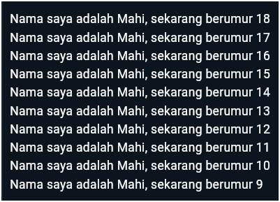

# *02 | Pengantar Bahasa Pemrograman Dart - Bagian 1 | Tugas Praktikum*

**Nama** : Mochammad Nizar Mahi

**NIM** : 2241720185

**Kelas** : TI-3F / 13

## Soal 1
```dart
void main() {
  for (int i = 18; i > 8; i--) {
    print('Nama saya adalah Mahi, sekarang berumur ${i}');
  }
}
```
Output :


## Soal 2
Mengapa sangat penting untuk memahami bahasa pemrograman Dart sebelum kita menggunakan framework Flutter ? Jelaskan!

**Jawaban** : Memahami bahasa pemrograman Dart penting sebelum menggunakan Flutter karena Flutter dibangun sepenuhnya di atas Dart, sehingga memahami dasar-dasar Dart akan mempermudah pengembangan dan optimasi aplikasi.

## Soal 3
Rangkumlah materi dari codelab ini menjadi poin-poin penting yang dapat Anda gunakan untuk membantu proses pengembangan aplikasi mobile menggunakan framework Flutter.

**Jawaban** : 

- Pengertian Dart

> Bahasa Dart merupakan inti dari framework Flutter, yang dirancang untuk memberikan pengalaman terbaik bagi pengembang dalam membuat aplikasi seluler modern. Pentingnya memahami Dart mencakup asal-usulnya, kelebihan, dan alasan dipilihnya sebagai bahasa untuk Flutter. Disini kita akan mempelajari dasar-dasar Dart, termasuk tipe data, operator, dan pemrograman berorientasi objek (OOP). Dengan pemahaman ini, Anda akan lebih percaya diri bereksperimen dan memperluas pengetahuan dalam pengembangan menggunakan Flutter.

- Kelebihan Dart

> Kelebihan utama Dart adalah menggabungkan kelebihan dari bahasa tingkat tinggi dengan fitur modern seperti **productive tooling** untuk analisis kode, **garbage collection** untuk manajemen memori, **type annotations** opsional untuk keamanan, dan **statically typed** untuk menemukan bug saat kompilasi. Dart juga mendukung **portability**, dapat digunakan untuk web (JavaScript) dan dikompilasi native ke ARM atau x86. Pengembangan Flutter membutuhkan pemahaman mendalam tentang Dart karena semua kode aplikasi, plugin, dan manajemen dependensi menggunakan fitur-fitur Dart tersebut.

- Evolusi Dart

> Diluncurkan pada 2011 dan stabil pada 2013, Dart awalnya berfokus pada pengembangan web sebagai pengganti JavaScript, namun sejak 2018 beralih ke pengembangan mobile melalui Flutter. Dart berupaya memecahkan kelemahan JavaScript dengan menawarkan ketahanan, performa tinggi, dan alat modern yang cocok untuk proyek besar. Dirancang kuat dan fleksibel, Dart mempertahankan type annotations opsional serta fitur OOP, sehingga mampu menyeimbangkan fleksibilitas dan ketangguhan dalam pengembangan aplikasi.

- Bagaimana Dart Bekerja

> Dart dapat mengeksekusi kode melalui dua cara: **Dart Virtual Machine (VM)** dan **kompilasi ke JavaScript**. Eksekusi ini mendukung cross-platform tanpa banyak perubahan kode. Dart VM mendukung dua mode kompilasi:
> 1. **Kompilasi Just-In-Time (JIT)**: Kode dikompilasi saat dibutuhkan, cocok untuk pengembangan dengan fitur seperti debugging dan hot reload.
> 2. **Kompilasi Ahead-Of-Time (AOT)**: Kode dikompilasi sebelumnya untuk performa optimal, namun fitur seperti debugging dan hot reload tidak tersedia.

>Dart VM juga mengelola runtime system, core libraries, dan garbage collection.

- Struktur Bahasa Pemrograman Dart

> Dart memiliki struktur sintaks yang mirip dengan bahasa seperti C dan JavaScript, sehingga mudah dipahami bagi yang sudah familiar dengan bahasa-bahasa tersebut. Dart adalah bahasa object-oriented (OO) yang mendukung fitur OOP seperti encapsulation, inheritance, polymorphism, dan abstraction. Operator Dart adalah method dengan sintaks khusus, memungkinkan operator seperti +, -, *, /, ==, dan lainnya diimplementasikan pada berbagai tipe data. Dart juga mendukung shortcut operators seperti += dan increment/decrement operators (++, --), serta equality, relational, dan logical operators (&&, ||, !). Dart memiliki keunggulan dalam type safety, tidak memerlukan operator seperti === dalam JavaScript karena membandingkan isi variabel secara langsung. 
