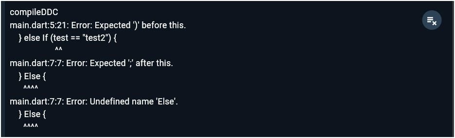
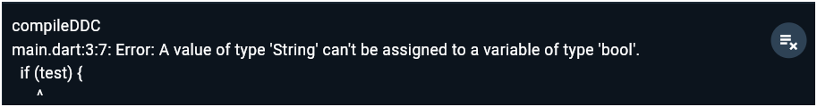
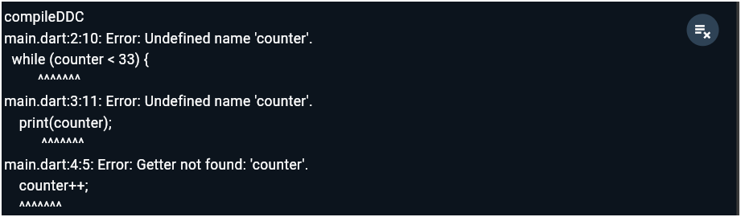
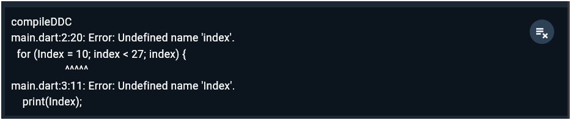
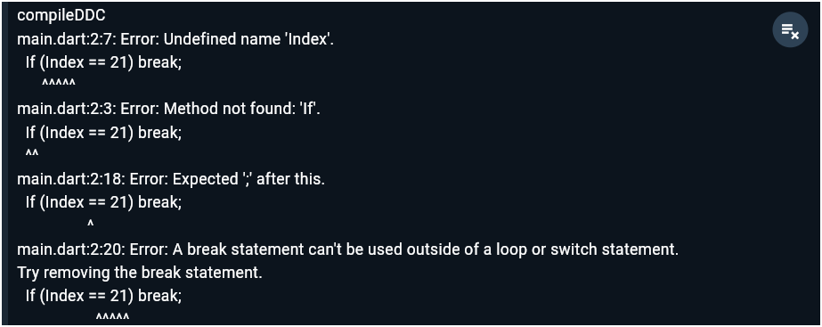
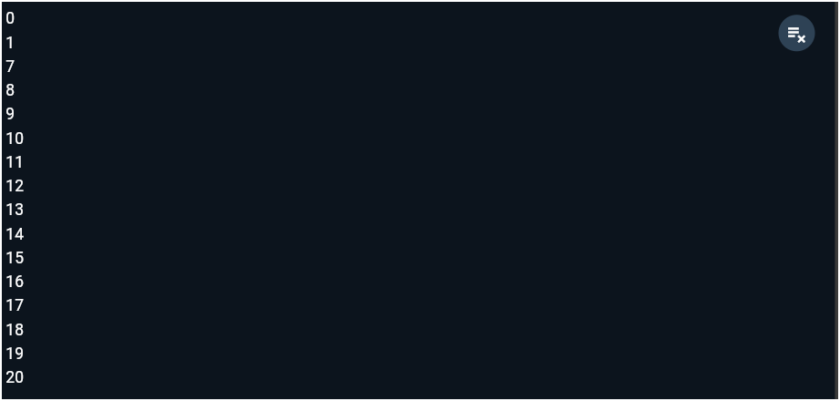
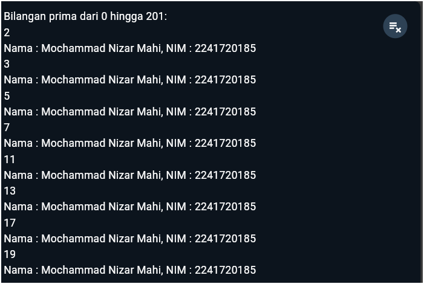

# *03 | Pengantar Bahasa Pemrograman Dart - Bagian 2*

**Nama** : Mochammad Nizar Mahi

**NIM** : 2241720185

**Kelas** : TI-3F / 13


## Praktikum 1 | Menerapkan Control Flows ("if/else")

```dart
void main() {
    String test = "test2";
    if (test == "test1") {
        print("Test1");
    } else If (test == "test2") {
        print("Test2");
    } Else {
        print("Something else");
    }

    if (test == "test2") print("Test2 again");
}
```
### Silakan coba eksekusi (Run) kode pada langkah 1 tersebut. Apa yang terjadi? Jelaskan!

Output:



**Jawab** : Yang akan terjadi adalah muncul pesan error, karena ada beberapa kode yang typo pada if, else if, dan else sehingga program tidak dapat berjalan, yang seharusnya menampilkan "test2" dan "test2 again"

```dart
String test = "true";
if (test) {
   print("Kebenaran");
}
```

### Apa yang terjadi ? Jika terjadi error, silakan perbaiki namun tetap menggunakan if/else.

Output :

 

**Jawab** : Yang akan terjadi adalah muncul pesan eror karena if else hanya menerima boolean true atau false, yang seharusnya muncul pesan "Kebenaran". Dengan cara menambahkan kode if=="true".

```dart
String test = "true";
if (test=="true") {
   print("Kebenaran");
}
```

 

## Praktikum 2 | Menerapkan Perulangan "while" dan "do-while"

```dart
while (counter < 33) {
  print(counter);
  counter++;
}
```

### Silakan coba eksekusi (Run) kode pada langkah 1 tersebut. Apa yang terjadi? Jelaskan! Lalu perbaiki jika terjadi error.

Output:


**Jawab** : Yang akan terjadi adalah muncul pesan error karena counter belum diinisiasi terlebih dahulu. Sehingga harus diinisasi dahulu

```dart
int counter = 1;
while (counter < 33) {
  print(counter);
  counter++;
}
```


```dart
int counter = 1; 
do {
  print(counter);
  counter++;
} while (counter < 77);

```

### Apa yang terjadi ? Jika terjadi error, silakan perbaiki namun tetap menggunakan do-while. 


**Jawab** : Yang terjadi adalah Output dari program ini menampilkan angka 1 hingga 76, karena loop akan berhenti ketika counter mencapai 77.

## Praktikum 3 | Menerapkan Perulangan "for" dan "break-continue"

```dart
for (Index = 10; index < 27; index) {
  print(Index);
}
```

### Silakan coba eksekusi (Run) kode pada langkah 1 tersebut. Apa yang terjadi? Jelaskan! Lalu perbaiki jika terjadi error.



**Jawab** : Yang terjadi adalah muncul pesan error karena kesalahan typo, dan juga tidak ada penambahan counter sehingga terjadi infinite loop, yang seharusnya menampilkan angka 10 hingga 26.

```dart
for (int index = 10; index < 27; index++) {
    print(index);
}
```


```dart
If (Index == 21) break;
Else If (index > 1 || index < 7) continue;
print(index);
```
### Apa yang terjadi? Jika terjadi error, silakan perbaiki namun tetap menggunakan for dan break-continue



**Jawab** : Yang terjadi adalah muncul pesan error karena kesalahan penulisan huruf dan continue hanya dapat digunakan pada konteks loop saja. Seharusnya akan menampilan 0, 1, 7 hingga 20.

```dart
  for (int index = 0; index < 30; index++) {
    if (index == 21) break;
    else if (index > 1 && index < 7) continue;
    print(index);
  }
```


## Tugas Praktikum

### Buatlah sebuah program yang dapat menampilkan bilangan prima dari angka 0 sampai 201 menggunakan Dart. Ketika bilangan prima ditemukan, maka tampilkan nama lengkap dan NIM Anda

```dart
void main() {
  String nama = "Mochammad Nizar Mahi";
  String nim = "2241720185";

  print("Bilangan prima dari 0 hingga 201:");

  for (int i = 2; i <= 201; i++) {
    bool isPrime = true;

    for (int j = 2; j <= i / 2; j++) {
      if (i % j == 0) {
        isPrime = false;
        break;
      }
    }

    if (isPrime) {
      print(i);
      print("Nama : $nama, NIM : $nim");
    }
  }
}
```

Output : 

