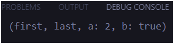

<<<<<<< HEAD

# *04 | Pengantar Bahasa Pemrograman Dart - Bagian 3*

**Nama** : Mochammad Nizar Mahi

**NIM** : 2241720185

**Kelas** : TI-3F / 13

## Praktikum 1 | Eksperimen Tipe Data List
**Langkah 1**:
```dart
var list = [1, 2, 3];
assert(list.length == 3);
assert(list[1] == 2);
print(list.length);
print(list[1]);

list[1] = 1;
assert(list[1] == 1);
print(list[1]);
```

**Langkah 2**:

Silakan coba eksekusi (Run) kode pada langkah 1 tersebut. Apa yang terjadi? Jelaskan!


**Jawab** : list dengan nilai [1, 2, 3] dan assert untuk memeriksa beberapa kondisi. Pertama, program memastikan panjang list adalah 3 dan elemen kedua bernilai 2, yang keduanya benar, sehingga tidak ada error. Program kemudian mencetak panjang list (3) dan elemen kedua (2). Setelah itu, elemen kedua diubah dari 2 menjadi 1, dan assert kembali memeriksa bahwa elemen kedua sekarang bernilai 1, yang juga benar. Program lalu mencetak nilai elemen kedua yang baru (1). Output akhirnya adalah 3, 2, dan 1.

**Langkah 3**:

```dart
  final List<String?> list = List.filled(5, null);

  String nama = "Mochammad Nizar Mahi";
  String nim = "2241720185";

  list[1] = nama;
  list[2] = nim;

  assert(list.length == 3);
  assert(list[1] == 2);
  print(list.length);
  print(list[1]);

  list[1] = '1';
  assert(list[1] == 1);
  print(list[1]);
```
Ubah kode pada langkah 1 menjadi variabel final yang mempunyai index = 5 dengan default value = null. Isilah nama dan NIM Anda pada elemen index ke-1 dan ke-2. Lalu print dan capture hasilnya.

Output : 


Apa yang terjadi ? Jika terjadi error, silakan perbaiki.

perbaikan : 

```dart
final List<String?> list = List.filled(5, null);

  String nama = "Mochammad Nizar Mahi";
  String nim = "2241720185";

  list[1] = nama;
  list[2] = nim;

  assert(list.length == 5);  // Karena list memiliki panjang 5, maka diganti dari 3 menjadi 5
  assert(list[1] == nama);   // Memastikan elemen list[1] adalah 'nama'
  print(list.length);
  print(list[1]);

  list[1] = '1';
  assert(list[1] == '1');   
  print(list[1]);
```

Output : 


## Praktikum 2 | Eksperimen Tipe Data Set

**Langkah 1**:

```dart
var halogens = {'fluorine', 'chlorine', 'bromine', 'iodine', 'astatine'};
print(halogens);
```

**Langkah 2**:

Silakan coba eksekusi (Run) kode pada langkah 1 tersebut. Apa yang terjadi? Jelaskan! Lalu perbaiki jika terjadi error.

Output : 


**Langkah 3**:

```dart
var names1 = <String>{};
Set<String> names2 = {}; // This works, too.
var names3 = {}; // Creates a map, not a set.

print(names1);
print(names2);
print(names3);
```

Apa yang terjadi ? Jika terjadi error, silakan perbaiki namun tetap menggunakan ketiga variabel tersebut. Tambahkan elemen nama dan NIM Anda pada kedua variabel Set tersebut dengan dua fungsi berbeda yaitu .add() dan .addAll().

**Jawab** : Yang terjadi adalah seolah" menampilkan 3 set kosong, padahal pada var names3 itu bukan sebuah set melainkan sebuah map, sehingga harus diganti supaya names3 menjadi set.

```dart
  var names1 = <String>{};   // Set kosong dengan tipe String
  Set<String> names2 = {};   // Set kosong dengan tipe String
  Set<String> names3 = <String>{}; // Set kosong dengan tipe String
```

Kemudian menambahkan elemen Nama dan Nim : 

```dart
// Tambahkan elemen menggunakan .add()
  names1.add("Mochammad Nizar Mahi");
  names2.add("2241720185");
  
  // Tambahkan elemen menggunakan .addAll()
  names3.addAll(["Mochammad Nizar Mahi", "2241720185"]);
  
  print("names1: $names1");
  print("names2: $names2");
  print("names3: $names3");
```

Output : 


## Praktikum 3 | Eksperimen Tipe Data Maps

**Langkah 1**:

```dart
var gifts = {
  // Key:    Value
  'first': 'partridge',
  'second': 'turtledoves',
  'fifth': 1
};

var nobleGases = {
  2: 'helium',
  10: 'neon',
  18: 2,
};

print(gifts);
print(nobleGases);
```

**Langkah 2**:

Silakan coba eksekusi (Run) kode pada langkah 1 tersebut. Apa yang terjadi? Jelaskan! Lalu perbaiki jika terjadi error.

Output : 


**Jawab** : Tidak terjadi eror, program berjalan sesuai dengan key-value yang benar pada masing-masing map.

**Langkah 3**:

```dart
var mhs1 = Map<String, String>();
gifts['first'] = 'partridge';
gifts['second'] = 'turtledoves';
gifts['fifth'] = 'golden rings';

var mhs2 = Map<int, String>();
nobleGases[2] = 'helium';
nobleGases[10] = 'neon';
nobleGases[18] = 'argon';
```

Apa yang terjadi ? Jika terjadi error, silakan perbaiki.

**Jawab** : Yang terjadi adalah pada gifts[fifth], value nya dirubah dari 1 menjadi 'golden rings', begitu juga value pada nobleGases[18] dari 2 menjadi 'argon'.

Tambahkan elemen nama dan NIM Anda pada tiap variabel di atas (gifts, nobleGases, mhs1, dan mhs2).

```dart
  gifts['nama'] = 'Mochammad Nizar Mahi';
  nobleGases[6] = 'Mochammad Nizar Mahi';
  mhs1['nama'] = 'Mochammad Nizar Mahi';
  mhs2[6] = 'Mochammad Nizar Mahi';

  gifts['nim'] = '2241720185';
  nobleGases[8] = '2241720185';
  mhs1['nim'] = '2241720185';
  mhs2[8] = '2241720185';

  print(gifts);
  print(nobleGases);
  print(mhs1);
  print(mhs2);
```

Output : 


## Praktikum 4 | Eksperimen Tipe Data List: Spread dan Control-flow Operators

**Langkah 1**:

```dart
var list = [1, 2, 3];
var list2 = [0, ...list];
print(list1);
print(list2);
print(list2.length);
```

Output : 


**Langkah 2**:

Silakan coba eksekusi (Run) kode pada langkah 1 tersebut. Apa yang terjadi? Jelaskan! Lalu perbaiki jika terjadi error.

**Jawab** : yang terjadi adalah muncul pesan eror, yang dikarenakan list1 belum didefinisikan. 

Perbaikan : 

```dart
var list = [1, 2, 3];
var list2 = [0, ...list];
print(list);
print(list2);
print(list2.length);
```

Output:


**Langkah 3**:

```dart
list1 = [1, 2, null];
print(list1);
var list3 = [0, ...?list1];
print(list3.length);
```

Apa yang terjadi ? Jika terjadi error, silakan perbaiki.
Tambahkan variabel list berisi NIM Anda menggunakan Spread Operators. Dokumentasikan hasilnya dan buat laporannya!

**Jawab** : 


Perubahan kode : 

```dart
  var list1 = [1, 2, null];
  print(list1);
  var list3 = [0, ...?list1];
  print(list3.length);

  var listNim = ['2241720185'];
  var listNim2 = [0, ...list3, ...listNim];
  print(listNim2.length);
```

**Langkah 4** :

```dart
var nav = ['Home', 'Furniture', 'Plants', if (promoActive) 'Outlet'];
print(nav);
```

Output:


Apa yang terjadi ? Jika terjadi error, silakan perbaiki. Tunjukkan hasilnya jika variabel promoActive ketika true dan false.

**Jawab** : Yang terjadi adalah akan muncul pesan eror yang disebabkan variabel promoActive belum didefinisikan. Sehingga perbaikan kode nya adalah menambah variabel promoActive dengan tiipe data boolean: 

```dart
  bool promoActive = true;
  var nav = ['Home', 'Furniture', 'Plants', if (promoActive) 'Outlet'];
  print(nav);
```

Output: 


**Langkah 5** : 

```dart
var nav2 = ['Home', 'Furniture', 'Plants', if (login case 'Manager') 'Inventory'];
print(nav2);
```

Output : 


Apa yang terjadi ? Jika terjadi error, silakan perbaiki. Tunjukkan hasilnya jika variabel login mempunyai kondisi lain.

**Jawab** : Yang terjadi adalah muncul pesan error yang disebabkan variabel login belum didesfiniskan sebagai apa. Sehingga perbaikan kodenya adalah dengan meambah variabel baru login denga tipe data string : 

```dart
  var login = 'Manager';
  var nav2 = [
    'Home',
    'Furniture',
    'Plants',
    if (login case 'Manager') 'Inventory'
  ];
  print(nav2);
```

Output : 


**Langkah 6**

```dart
var listOfInts = [1, 2, 3];
var listOfStrings = ['#0', for (var i in listOfInts) '#$i'];
assert(listOfStrings[1] == '#1');
print(listOfStrings);
```

Output : 


Apa yang terjadi ? Jika terjadi error, silakan perbaiki. Jelaskan manfaat Collection For dan dokumentasikan hasilnya.

**Jawab** : Pada kode tersebut tidak terjadi eror dan kode berjalan sesuai. Dan juga manfaat dari Collection For adalah efisiensi dan kemudahan untuk membangun koleksi yang dinamis berdasarkan kondisi tertentu atau hasil dari perulangan.

## Praktikum 5 | Eksperimen Tipe Data Records

**Langkah 1** : 

```dart
var record = ('first', a: 2, b: true, 'last');
print(record)
```

Output: 


**Langkah 2** : 

Silakan coba eksekusi (Run) kode pada langkah 1 tersebut. Apa yang terjadi? Jelaskan! Lalu perbaiki jika terjadi error.

**Jawab** : Yang terjadi adalah akan muncul pesan eror yang disebabkan kurang tanda (;) pada akhir kode print(record).

Output yang benar : 



**Langkah 3** :

```dart
void main(){
  var record = ('first', a: 2, b: true, 'last');
  print(record);
  
  var intRecord = (1, 2);
  var swapped = tukar(intRecord);
  print(swapped);
}

(int, int) tukar((int, int) record) {
  var (a, b) = record;
  return (b, a);
}
```

Output:


Apa yang terjadi ? Jika terjadi error, silakan perbaiki. Gunakan fungsi tukar() di dalam main() sehingga tampak jelas proses pertukaran value field di dalam Records.

**Jawab** :  Dalam kasus ini, fungsi tukar() bekerja dengan baik, dan records memungkinkan pertukaran nilai dua elemen secara langsung. Hasil dari program akan mencetak record asli ('first', a: 2, b: true, 'last') dan hasil pertukaran intRecord, sehingga output akhirnya akan menunjukkan intRecord berubah dari (1, 2) menjadi (2, 1). Hal ini menegaskan bahwa Dart mendukung operasi destructuring dan penggunaan records secara penuh di versi yang Anda gunakan.

**Langkah 4** : 

```dart
// Record type annotation in a variable declaration:
(String, int) mahasiswa = ("Mochammad Nizar Mahi", 2241720185);
print(mahasiswa);
```

Output : 


Apa yang terjadi ? Jika terjadi error, silakan perbaiki. Inisialisasi field nama dan NIM Anda pada variabel record mahasiswa di atas. Dokumentasikan hasilnya dan buat laporannya!

**Jawab** :  Dalam kasus ini, Anda dapat dengan mudah menambah
field pada record mahasiswa dengan menambahkan tipe data yang sesuai. Misalnya, Anda dapat menambahkan field jenis kelamin dengan tipe data String, atau field Nim dengan tipe data int. 

**Langkah 5** :

```dart
var mahasiswa2 = ('first', a: 2, b: true, 'last');

print(mahasiswa2.$1); // Prints 'first'
print(mahasiswa2.a); // Prints 2
print(mahasiswa2.b); // Prints true
print(mahasiswa2.$2); // Prints 'last'
```

Output : 


Apa yang terjadi ? Jika terjadi error, silakan perbaiki. Gantilah salah satu isi record dengan nama dan NIM Anda, lalu dokumentasikan hasilnya dan buat laporannya!

**Jawab** :  Dalam kasus ini, Anda dapat dengan mudah mengakses field pada record mahasiswa2 dengan menggunakan sintaks dot notation atau menggunakan operator $ untuk mengakses field dengan nama yang lebih panjang. Misalnya, Anda dapat menulis print(mahasiswa2.first) untuk mengakses field 'first' pada record mahasiswa2. 

## Tugas Praktikum

1. Jelaskan yang dimaksud Functions dalam bahasa Dart!
2. Jelaskan jenis-jenis parameter di Functions beserta contoh sintaksnya!
3. Jelaskan maksud Functions sebagai first-class objects beserta contoh sintaknya!
4. Apa itu Anonymous Functions? Jelaskan dan berikan contohnya!
5. Jelaskan perbedaan Lexical scope dan Lexical closures! Berikan contohnya!
6. Jelaskan dengan contoh cara membuat return multiple value di Functions!

**Jawab** : 

1. Functions dalam bahasa Dart adalah blok kode yang dapat dipanggil dan dieksekusi untuk melakukan tugas tertentu. Function memungkinkan kita mengelompokkan sejumlah instruksi ke dalam satu unit untuk menghindari pengulangan kode. Dart mendukung deklarasi dan penggunaan fungsi dengan berbagai cara, baik fungsi dengan nama yang jelas atau fungsi anonim.

Contoh : 
```dart
void nama(String name) {
  print("Halo, nama saya $name!");
}

nama("Mahi"); // Output: Halo, nama saya Mahi!
```

2. Jenis-jenis Parameter functions di dalam Bahasa dart
- **Positional Parameters** : Parameter yang posisinya penting saat memanggil fungsi. Harus dipanggil sesuai urutan.

Contoh :
```dart
void nama(String first, String last) {
  print("Halo, nama saya $first $last!");
}

nama("Nizar", "Mahi") // Output: Halo, nama saya Nizar Mahi
```

- **Optional Positional Parameters** : Parameter yang posisinya opsional dan dapat ditinggalkan saat pemanggilan fungsi. Diberi tanda [] di deklarasi fungsi.

Contoh :
```dart
void nama(String first, [String? last]) {
  print("Halo, $first ${last ?? ''}");
}

nama("Mahi");          // Output: Halo, Mahi
nama("Nizar", "Mahi"); // Output: Halo, Andi Mahi
```

- **Named Parameters** : Parameter yang dapat dipanggil dengan nama saat pemanggilan fungsi. Diberi tanda {} di deklarasi fungsi.

Contoh : 
```dart
void greet({required String first, String? last}) {
  print("Halo, $first ${last ?? ''}");
}

greet(first: "Mahi");             // Output: Halo, Mahi
greet(first: "Nizar", last: "Mahi"); // Output: Halo, Nizar Mahi
```

3. Di Dart, fungsi dianggap sebagai first-class objects, artinya fungsi dapat disimpan dalam variabel, dikembalikan dari fungsi lain, atau dilewatkan sebagai argumen ke fungsi lain.

Contoh : 
```dart
void printMessage(String message) {
  print(message);
}

void executeFunction(void Function(String) func, String value) {
  func(value);
}

void main() {
  var myFunction = printMessage;
  executeFunction(myFunction, "Hello from first-class function!");
}
```

Dalam contoh di atas, fungsi `printMessage` disimpan dalam variabel `myFunction` dan kemudian dilewatkan sebagai argumen ke fungsi `executeFunction`. Fungsi `executeFunction` kemudian mengembalikan fungsi `printMessage` dengan nilai `"Hello from first-class function!"`.

4. Anonymous functions (fungsi anonim) adalah fungsi tanpa nama. Fungsi ini biasanya digunakan ketika sebuah fungsi hanya dibutuhkan untuk satu kali penggunaan, seperti pada callback atau event handler.

Contoh : 
```dart
var numbers = [1, 2, 3, 4, 5];
numbers.forEach((num) {
  print(num * num);  // Output: 1, 4, 9, 16, 25
});
```

5. Perbedaan Lexical Scope dan Lexical Closures:
- Lexical Scope: adalah konsep di mana variabel yang terdefinisi di luar fungsi dapat diakses oleh fungsi yang terdefinisi di dalamnya.

Contoh : 
```dart
void main() {
  var message = "Hello";
  
  void showMessage() {
    print(message);  // Output: Hello
  }

  showMessage();
}
```

- Lexical Closures: adalah konsep di mana fungsi yang terdefinisi di dalam fungsi lain dapat mengakses variabel yang terdefinisi di luar fungsi tersebut

Contoh : 
```dart
Function makeMultiplier(num multiplier) {
  return (num value) => value * multiplier;
}

void main() {
  var doubleValue = makeMultiplier(2);
  print(doubleValue(5));  // Output: 10
}
```

6. Di Dart, fungsi tidak mendukung secara langsung pengembalian beberapa nilai. Namun, kita bisa menggunakan tuple-like structure seperti list atau map untuk mengembalikan beberapa nilai sekaligus.

Contoh : 
```dart
List<int> getMinMax(List<int> numbers) {
  numbers.sort();
  return [numbers.first, numbers.last];
}

void main() {
  var result = getMinMax([5, 3, 9, 1, 7]);
  print("Min: ${result[0]}, Max: ${result[1]}");  // Output: Min: 1, Max: 9
}
```

=======

# *04 | Pengantar Bahasa Pemrograman Dart - Bagian 3*

**Nama** : Mochammad Nizar Mahi

**NIM** : 2241720185

**Kelas** : TI-3F / 13

## Praktikum 1 | Eksperimen Tipe Data List
**Langkah 1**:
```dart
var list = [1, 2, 3];
assert(list.length == 3);
assert(list[1] == 2);
print(list.length);
print(list[1]);

list[1] = 1;
assert(list[1] == 1);
print(list[1]);
```

**Langkah 2**:

Silakan coba eksekusi (Run) kode pada langkah 1 tersebut. Apa yang terjadi? Jelaskan!


**Jawab** : list dengan nilai [1, 2, 3] dan assert untuk memeriksa beberapa kondisi. Pertama, program memastikan panjang list adalah 3 dan elemen kedua bernilai 2, yang keduanya benar, sehingga tidak ada error. Program kemudian mencetak panjang list (3) dan elemen kedua (2). Setelah itu, elemen kedua diubah dari 2 menjadi 1, dan assert kembali memeriksa bahwa elemen kedua sekarang bernilai 1, yang juga benar. Program lalu mencetak nilai elemen kedua yang baru (1). Output akhirnya adalah 3, 2, dan 1.

**Langkah 3**:

```dart
  final List<String?> list = List.filled(5, null);

  String nama = "Mochammad Nizar Mahi";
  String nim = "2241720185";

  list[1] = nama;
  list[2] = nim;

  assert(list.length == 3);
  assert(list[1] == 2);
  print(list.length);
  print(list[1]);

  list[1] = '1';
  assert(list[1] == 1);
  print(list[1]);
```
Ubah kode pada langkah 1 menjadi variabel final yang mempunyai index = 5 dengan default value = null. Isilah nama dan NIM Anda pada elemen index ke-1 dan ke-2. Lalu print dan capture hasilnya.

Output : 


Apa yang terjadi ? Jika terjadi error, silakan perbaiki.

perbaikan : 

```dart
final List<String?> list = List.filled(5, null);

  String nama = "Mochammad Nizar Mahi";
  String nim = "2241720185";

  list[1] = nama;
  list[2] = nim;

  assert(list.length == 5);  // Karena list memiliki panjang 5, maka diganti dari 3 menjadi 5
  assert(list[1] == nama);   // Memastikan elemen list[1] adalah 'nama'
  print(list.length);
  print(list[1]);

  list[1] = '1';
  assert(list[1] == '1');   
  print(list[1]);
```

Output : 


## Praktikum 2 | Eksperimen Tipe Data Set

**Langkah 1**:

```dart
var halogens = {'fluorine', 'chlorine', 'bromine', 'iodine', 'astatine'};
print(halogens);
```

**Langkah 2**:

Silakan coba eksekusi (Run) kode pada langkah 1 tersebut. Apa yang terjadi? Jelaskan! Lalu perbaiki jika terjadi error.

Output : 


**Langkah 3**:

```dart
var names1 = <String>{};
Set<String> names2 = {}; // This works, too.
var names3 = {}; // Creates a map, not a set.

print(names1);
print(names2);
print(names3);
```

Apa yang terjadi ? Jika terjadi error, silakan perbaiki namun tetap menggunakan ketiga variabel tersebut. Tambahkan elemen nama dan NIM Anda pada kedua variabel Set tersebut dengan dua fungsi berbeda yaitu .add() dan .addAll().

**Jawab** : Yang terjadi adalah seolah" menampilkan 3 set kosong, padahal pada var names3 itu bukan sebuah set melainkan sebuah map, sehingga harus diganti supaya names3 menjadi set.

```dart
  var names1 = <String>{};   // Set kosong dengan tipe String
  Set<String> names2 = {};   // Set kosong dengan tipe String
  Set<String> names3 = <String>{}; // Set kosong dengan tipe String
```

Kemudian menambahkan elemen Nama dan Nim : 

```dart
// Tambahkan elemen menggunakan .add()
  names1.add("Mochammad Nizar Mahi");
  names2.add("2241720185");
  
  // Tambahkan elemen menggunakan .addAll()
  names3.addAll(["Mochammad Nizar Mahi", "2241720185"]);
  
  print("names1: $names1");
  print("names2: $names2");
  print("names3: $names3");
```

Output : 


## Praktikum 3 | Eksperimen Tipe Data Maps

**Langkah 1**:

```dart
var gifts = {
  // Key:    Value
  'first': 'partridge',
  'second': 'turtledoves',
  'fifth': 1
};

var nobleGases = {
  2: 'helium',
  10: 'neon',
  18: 2,
};

print(gifts);
print(nobleGases);
```

**Langkah 2**:

Silakan coba eksekusi (Run) kode pada langkah 1 tersebut. Apa yang terjadi? Jelaskan! Lalu perbaiki jika terjadi error.

Output : 


**Jawab** : Tidak terjadi eror, program berjalan sesuai dengan key-value yang benar pada masing-masing map.

**Langkah 3**:

```dart
var mhs1 = Map<String, String>();
gifts['first'] = 'partridge';
gifts['second'] = 'turtledoves';
gifts['fifth'] = 'golden rings';

var mhs2 = Map<int, String>();
nobleGases[2] = 'helium';
nobleGases[10] = 'neon';
nobleGases[18] = 'argon';
```

Apa yang terjadi ? Jika terjadi error, silakan perbaiki.

**Jawab** : Yang terjadi adalah pada gifts[fifth], value nya dirubah dari 1 menjadi 'golden rings', begitu juga value pada nobleGases[18] dari 2 menjadi 'argon'.

Tambahkan elemen nama dan NIM Anda pada tiap variabel di atas (gifts, nobleGases, mhs1, dan mhs2).

```dart
  gifts['nama'] = 'Mochammad Nizar Mahi';
  nobleGases[6] = 'Mochammad Nizar Mahi';
  mhs1['nama'] = 'Mochammad Nizar Mahi';
  mhs2[6] = 'Mochammad Nizar Mahi';

  gifts['nim'] = '2241720185';
  nobleGases[8] = '2241720185';
  mhs1['nim'] = '2241720185';
  mhs2[8] = '2241720185';

  print(gifts);
  print(nobleGases);
  print(mhs1);
  print(mhs2);
```

Output : 


## Praktikum 4 | Eksperimen Tipe Data List: Spread dan Control-flow Operators

**Langkah 1**:

```dart
var list = [1, 2, 3];
var list2 = [0, ...list];
print(list1);
print(list2);
print(list2.length);
```

Output : 


**Langkah 2**:

Silakan coba eksekusi (Run) kode pada langkah 1 tersebut. Apa yang terjadi? Jelaskan! Lalu perbaiki jika terjadi error.

**Jawab** : yang terjadi adalah muncul pesan eror, yang dikarenakan list1 belum didefinisikan. 

Perbaikan : 

```dart
var list = [1, 2, 3];
var list2 = [0, ...list];
print(list);
print(list2);
print(list2.length);
```

Output:


**Langkah 3**:

```dart
list1 = [1, 2, null];
print(list1);
var list3 = [0, ...?list1];
print(list3.length);
```

Apa yang terjadi ? Jika terjadi error, silakan perbaiki.
Tambahkan variabel list berisi NIM Anda menggunakan Spread Operators. Dokumentasikan hasilnya dan buat laporannya!

**Jawab** : 


Perubahan kode : 

```dart
  var list1 = [1, 2, null];
  print(list1);
  var list3 = [0, ...?list1];
  print(list3.length);

  var listNim = ['2241720185'];
  var listNim2 = [0, ...list3, ...listNim];
  print(listNim2.length);
```

**Langkah 4** :

```dart
var nav = ['Home', 'Furniture', 'Plants', if (promoActive) 'Outlet'];
print(nav);
```

Output:


Apa yang terjadi ? Jika terjadi error, silakan perbaiki. Tunjukkan hasilnya jika variabel promoActive ketika true dan false.

**Jawab** : Yang terjadi adalah akan muncul pesan eror yang disebabkan variabel promoActive belum didefinisikan. Sehingga perbaikan kode nya adalah menambah variabel promoActive dengan tiipe data boolean: 

```dart
  bool promoActive = true;
  var nav = ['Home', 'Furniture', 'Plants', if (promoActive) 'Outlet'];
  print(nav);
```

Output: 


**Langkah 5** : 

```dart
var nav2 = ['Home', 'Furniture', 'Plants', if (login case 'Manager') 'Inventory'];
print(nav2);
```

Output : 


Apa yang terjadi ? Jika terjadi error, silakan perbaiki. Tunjukkan hasilnya jika variabel login mempunyai kondisi lain.

**Jawab** : Yang terjadi adalah muncul pesan error yang disebabkan variabel login belum didesfiniskan sebagai apa. Sehingga perbaikan kodenya adalah dengan meambah variabel baru login denga tipe data string : 

```dart
  var login = 'Manager';
  var nav2 = [
    'Home',
    'Furniture',
    'Plants',
    if (login case 'Manager') 'Inventory'
  ];
  print(nav2);
```

Output : 


**Langkah 6**

```dart
var listOfInts = [1, 2, 3];
var listOfStrings = ['#0', for (var i in listOfInts) '#$i'];
assert(listOfStrings[1] == '#1');
print(listOfStrings);
```

Output : 


Apa yang terjadi ? Jika terjadi error, silakan perbaiki. Jelaskan manfaat Collection For dan dokumentasikan hasilnya.

**Jawab** : Pada kode tersebut tidak terjadi eror dan kode berjalan sesuai. Dan juga manfaat dari Collection For adalah efisiensi dan kemudahan untuk membangun koleksi yang dinamis berdasarkan kondisi tertentu atau hasil dari perulangan.

## Praktikum 5 | Eksperimen Tipe Data Records

**Langkah 1** : 

```dart
var record = ('first', a: 2, b: true, 'last');
print(record)
```

Output: 


**Langkah 2** : 

Silakan coba eksekusi (Run) kode pada langkah 1 tersebut. Apa yang terjadi? Jelaskan! Lalu perbaiki jika terjadi error.

**Jawab** : Yang terjadi adalah akan muncul pesan eror yang disebabkan kurang tanda (;) pada akhir kode print(record).

Output yang benar : 


**Langkah 3** :

```dart
void main(){
  var record = ('first', a: 2, b: true, 'last');
  print(record);
  
  var intRecord = (1, 2);
  var swapped = tukar(intRecord);
  print(swapped);
}

(int, int) tukar((int, int) record) {
  var (a, b) = record;
  return (b, a);
}
```

Output:


Apa yang terjadi ? Jika terjadi error, silakan perbaiki. Gunakan fungsi tukar() di dalam main() sehingga tampak jelas proses pertukaran value field di dalam Records.

**Jawab** :  Dalam kasus ini, fungsi tukar() bekerja dengan baik, dan records memungkinkan pertukaran nilai dua elemen secara langsung. Hasil dari program akan mencetak record asli ('first', a: 2, b: true, 'last') dan hasil pertukaran intRecord, sehingga output akhirnya akan menunjukkan intRecord berubah dari (1, 2) menjadi (2, 1). Hal ini menegaskan bahwa Dart mendukung operasi destructuring dan penggunaan records secara penuh di versi yang Anda gunakan.

**Langkah 4** : 

```dart
// Record type annotation in a variable declaration:
(String, int) mahasiswa = ("Mochammad Nizar Mahi", 2241720185);
print(mahasiswa);
```

Output : 


Apa yang terjadi ? Jika terjadi error, silakan perbaiki. Inisialisasi field nama dan NIM Anda pada variabel record mahasiswa di atas. Dokumentasikan hasilnya dan buat laporannya!

**Jawab** :  Dalam kasus ini, Anda dapat dengan mudah menambah
field pada record mahasiswa dengan menambahkan tipe data yang sesuai. Misalnya, Anda dapat menambahkan field jenis kelamin dengan tipe data String, atau field Nim dengan tipe data int. 

**Langkah 5** :

```dart
var mahasiswa2 = ('first', a: 2, b: true, 'last');

print(mahasiswa2.$1); // Prints 'first'
print(mahasiswa2.a); // Prints 2
print(mahasiswa2.b); // Prints true
print(mahasiswa2.$2); // Prints 'last'
```

Output : 


Apa yang terjadi ? Jika terjadi error, silakan perbaiki. Gantilah salah satu isi record dengan nama dan NIM Anda, lalu dokumentasikan hasilnya dan buat laporannya!

**Jawab** :  Dalam kasus ini, Anda dapat dengan mudah mengakses field pada record mahasiswa2 dengan menggunakan sintaks dot notation atau menggunakan operator $ untuk mengakses field dengan nama yang lebih panjang. Misalnya, Anda dapat menulis print(mahasiswa2.first) untuk mengakses field 'first' pada record mahasiswa2. 

## Tugas Praktikum

1. Jelaskan yang dimaksud Functions dalam bahasa Dart!
2. Jelaskan jenis-jenis parameter di Functions beserta contoh sintaksnya!
3. Jelaskan maksud Functions sebagai first-class objects beserta contoh sintaknya!
4. Apa itu Anonymous Functions? Jelaskan dan berikan contohnya!
5. Jelaskan perbedaan Lexical scope dan Lexical closures! Berikan contohnya!
6. Jelaskan dengan contoh cara membuat return multiple value di Functions!

**Jawab** : 

1. Functions dalam bahasa Dart adalah blok kode yang dapat dipanggil dan dieksekusi untuk melakukan tugas tertentu. Function memungkinkan kita mengelompokkan sejumlah instruksi ke dalam satu unit untuk menghindari pengulangan kode. Dart mendukung deklarasi dan penggunaan fungsi dengan berbagai cara, baik fungsi dengan nama yang jelas atau fungsi anonim.

Contoh : 
```dart
void nama(String name) {
  print("Halo, nama saya $name!");
}

nama("Mahi"); // Output: Halo, nama saya Mahi!
```

2. Jenis-jenis Parameter functions di dalam Bahasa dart
- **Positional Parameters** : Parameter yang posisinya penting saat memanggil fungsi. Harus dipanggil sesuai urutan.

Contoh :
```dart
void nama(String first, String last) {
  print("Halo, nama saya $first $last!");
}

nama("Nizar", "Mahi") // Output: Halo, nama saya Nizar Mahi
```

- **Optional Positional Parameters** : Parameter yang posisinya opsional dan dapat ditinggalkan saat pemanggilan fungsi. Diberi tanda [] di deklarasi fungsi.

Contoh :
```dart
void nama(String first, [String? last]) {
  print("Halo, $first ${last ?? ''}");
}

nama("Mahi");          // Output: Halo, Mahi
nama("Nizar", "Mahi"); // Output: Halo, Andi Mahi
```

- **Named Parameters** : Parameter yang dapat dipanggil dengan nama saat pemanggilan fungsi. Diberi tanda {} di deklarasi fungsi.

Contoh : 
```dart
void greet({required String first, String? last}) {
  print("Halo, $first ${last ?? ''}");
}

greet(first: "Mahi");             // Output: Halo, Mahi
greet(first: "Nizar", last: "Mahi"); // Output: Halo, Nizar Mahi
```

3. Di Dart, fungsi dianggap sebagai first-class objects, artinya fungsi dapat disimpan dalam variabel, dikembalikan dari fungsi lain, atau dilewatkan sebagai argumen ke fungsi lain.

Contoh : 
```dart
void printMessage(String message) {
  print(message);
}

void executeFunction(void Function(String) func, String value) {
  func(value);
}

void main() {
  var myFunction = printMessage;
  executeFunction(myFunction, "Hello from first-class function!");
}
```

Dalam contoh di atas, fungsi `printMessage` disimpan dalam variabel `myFunction` dan kemudian dilewatkan sebagai argumen ke fungsi `executeFunction`. Fungsi `executeFunction` kemudian mengembalikan fungsi `printMessage` dengan nilai `"Hello from first-class function!"`.

4. Anonymous functions (fungsi anonim) adalah fungsi tanpa nama. Fungsi ini biasanya digunakan ketika sebuah fungsi hanya dibutuhkan untuk satu kali penggunaan, seperti pada callback atau event handler.

Contoh : 
```dart
var numbers = [1, 2, 3, 4, 5];
numbers.forEach((num) {
  print(num * num);  // Output: 1, 4, 9, 16, 25
});
```

5. Perbedaan Lexical Scope dan Lexical Closures:
- Lexical Scope: adalah konsep di mana variabel yang terdefinisi di luar fungsi dapat diakses oleh fungsi yang terdefinisi di dalamnya.

Contoh : 
```dart
void main() {
  var message = "Hello";
  
  void showMessage() {
    print(message);  // Output: Hello
  }

  showMessage();
}
```

- Lexical Closures: adalah konsep di mana fungsi yang terdefinisi di dalam fungsi lain dapat mengakses variabel yang terdefinisi di luar fungsi tersebut

Contoh : 
```dart
Function makeMultiplier(num multiplier) {
  return (num value) => value * multiplier;
}

void main() {
  var doubleValue = makeMultiplier(2);
  print(doubleValue(5));  // Output: 10
}
```

6. Di Dart, fungsi tidak mendukung secara langsung pengembalian beberapa nilai. Namun, kita bisa menggunakan tuple-like structure seperti list atau map untuk mengembalikan beberapa nilai sekaligus.

Contoh : 
```dart
List<int> getMinMax(List<int> numbers) {
  numbers.sort();
  return [numbers.first, numbers.last];
}

void main() {
  var result = getMinMax([5, 3, 9, 1, 7]);
  print("Min: ${result[0]}, Max: ${result[1]}");  // Output: Min: 1, Max: 9
}
```

>>>>>>> af9da494998d5c96953c82b095aef26cf777a6fa
