# *05 | Aplikasi Pertama dan Widget Dasar Flutter*

**Nama** : Mochammad Nizar Mahi

**NIM** : 2241720185

**Kelas** : TI-3F / 13

---
## Praktikum 1 | Membuat Project Flutter Baru

### Langkah 1 : Membuka VS Code untuk membuat project baru 

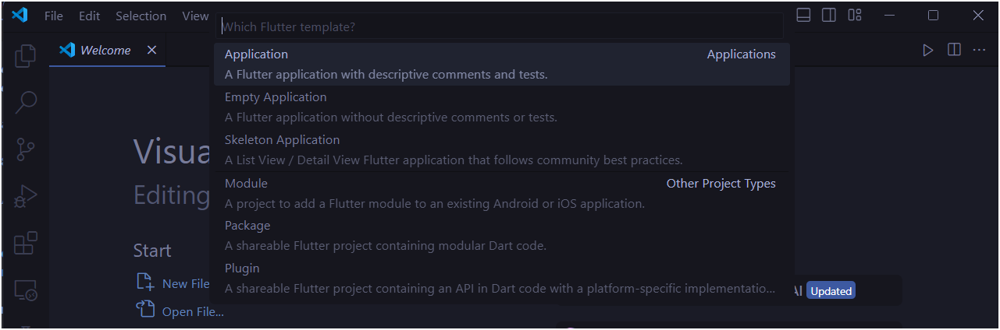

### Langkah 2 : Memilih direktori folder 

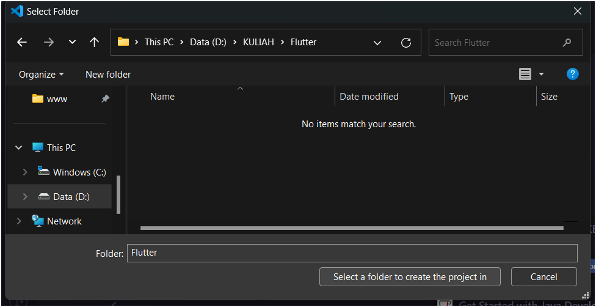

### Langkah 3 : Membuat nama project flutter dengan nama "hello_world"

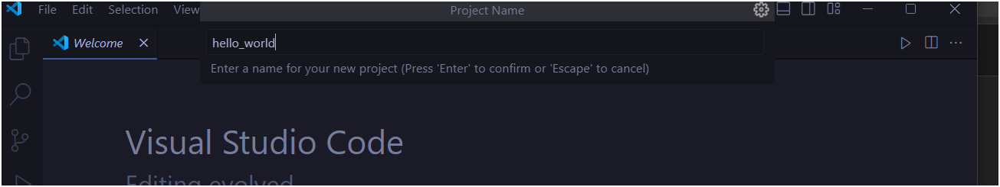

### Langkah 4 : Project Flutter Siap

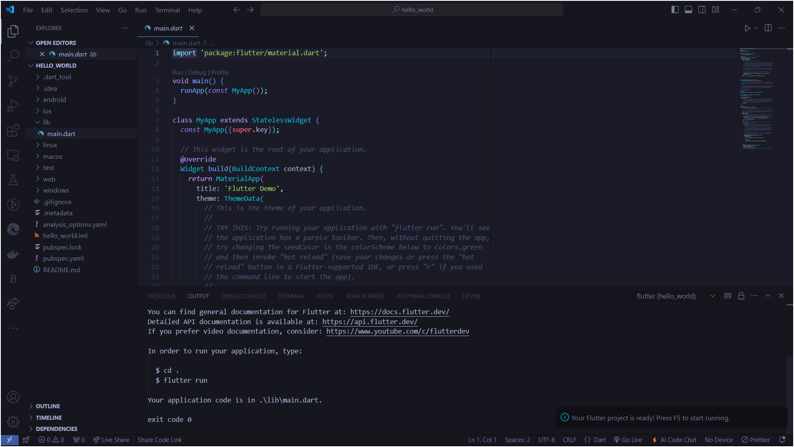

## Praktikum 2 | Menghubungkan Perangkat Android atau Emulator

### Hasil Praktikum 2 


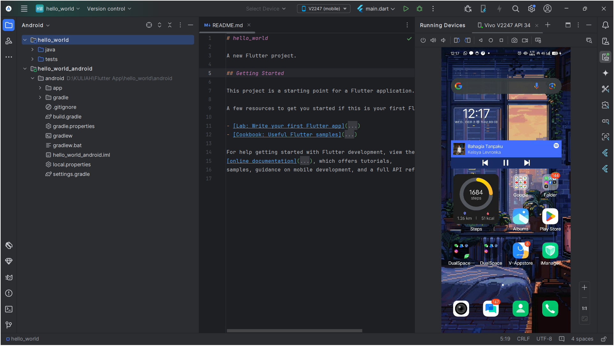

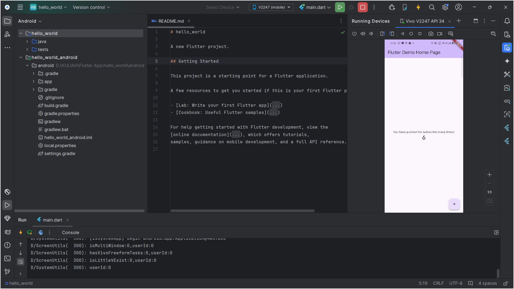

## Praktikum 3 | Membuat Repository GitHub dan Laporan Praktikum

### Langkah 1 | Membuat Repoository Baru dengan nama flutter_fundamental_part1

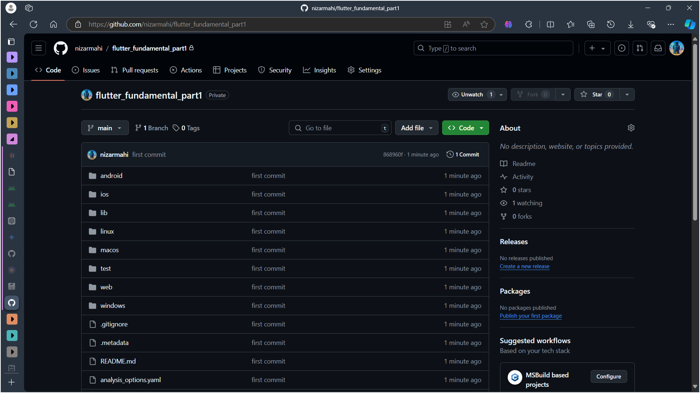

### Langkah 2 | Hasil Run dan Debug pada Chrome

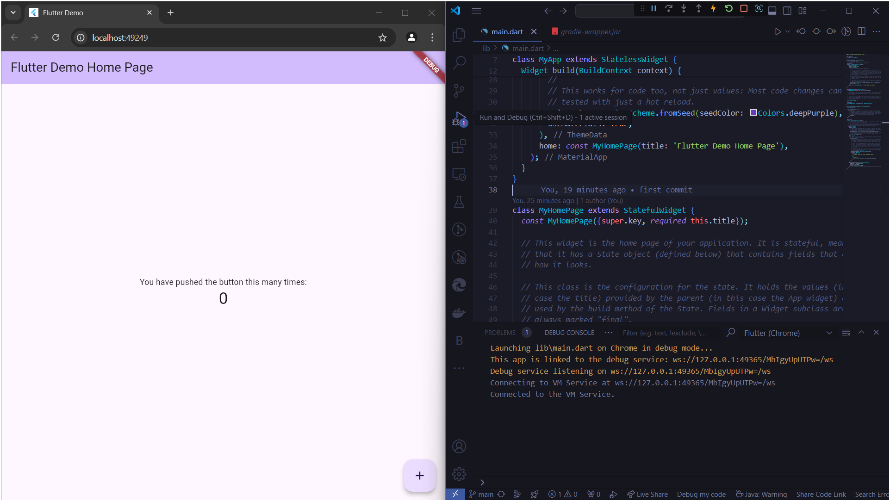

- Link Repository : [flutter_fundamental_part1](https://github.com/nizarmahi/flutter_fundamental_part1)

## Praktikumm 4 | Menerapkan Widget Dasar

### Langkah 1 | Text Widget

- Membuat file baru dengan nama `text_widget.dart` dan kode 
```dart
import 'package:flutter/material.dart';

class MyTextWidget extends StatelessWidget {
  const MyTextWidget({Key? key}) : super(key: key);

  @override
  Widget build(BuildContext context) {
    return const Text(
        "Nama saya Mochammad Nizar Mahi, sedang belajar Pemrograman Mobile",
        style: TextStyle(color: Colors.red, fontSize: 14),
        textAlign: TextAlign.center);
  }
}
```
- Import file `text_widget.dart` ke `main.dart` lalu ganti bagian text widget dengan kode di atas. 
- Hasil Kode : 

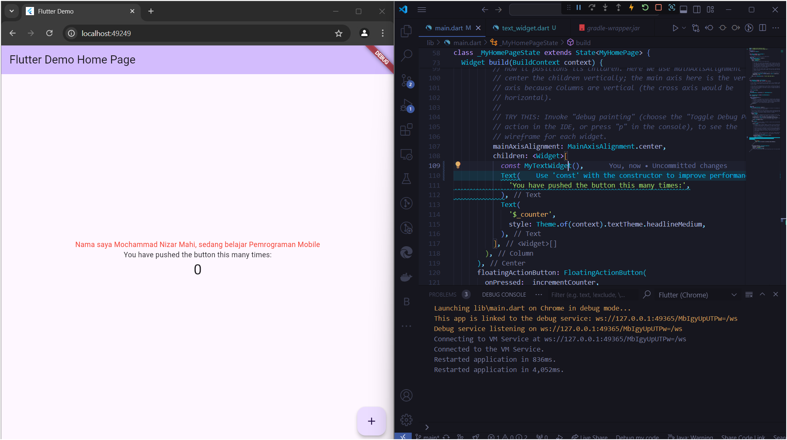

### Langkah 2 | Image Widget

- Membuat file baru dengan nama `image_widget.dart` dan kode 
```dart
import 'package:flutter/material.dart';

class MyImageWidget extends StatelessWidget {
  const MyImageWidget({Key? key}) : super(key: key);

  @override
  Widget build(BuildContext context) {
    return const Image(
      image: AssetImage("logo_polinema.jpg") // Sesuaikan dengan nama gambar anda
    );
  }
}
```

- Lakukan penyesuaian asset pada file pubspec.yaml dan tambahkan file logo Anda di folder assets project hello_world.

```
flutter:
  assets:
     - logo_polinema.jpg
```

- Hasil Langkah 2 :

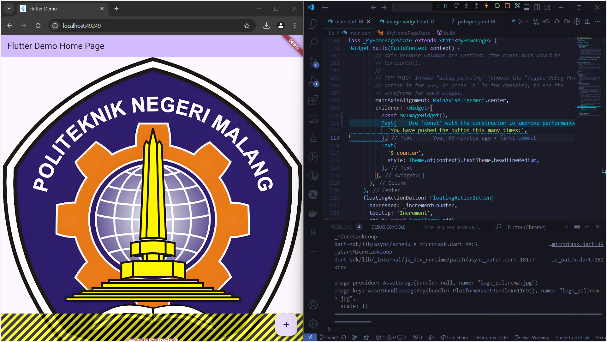

## Praktikumm 5 | Menerapkan Widget Material Design dan iOS Cupertino

### Langkah 1 | Cupertino Button dan Loading Bar
- Membuat file baru dengan nama `loading_cupertino.dart` dengan kode :
```dart
import 'package:flutter/material.dart';
import 'package:flutter/cupertino.dart';

class MyLoadingCupertino extends StatelessWidget {
  const MyLoadingCupertino({Key? key}) : super(key: key);

  @override
  Widget build(BuildContext context) {
    return MaterialApp(
      home: Container(
        margin: const EdgeInsets.only(top: 30),
        color: Colors.white,
        child: Column(
          children: <Widget>[
            CupertinoButton(
              child: const Text("Contoh button"),
              onPressed: () {},
            ),
            const CupertinoActivityIndicator(),
          ],
        ),
      ),
    );
  }
}
```

- Hasil : 
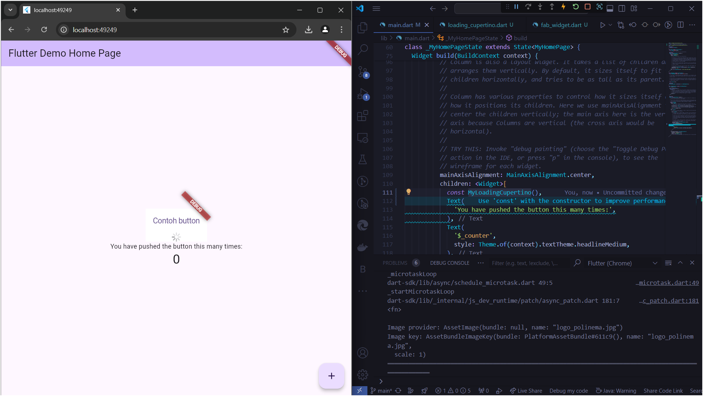

### Langkah 2 | Floating Action Button
- Membuat file baru dengan nama `fab_widget.dart` dengan kode :

```dart
import 'package:flutter/material.dart';

class MyFabWidget extends StatelessWidget {
  const MyFabWidget({Key? key}) : super(key: key);

  @override
  Widget build(BuildContext context) {
    return MaterialApp(
      home: Scaffold(
        floatingActionButton: FloatingActionButton(
          onPressed: () {
            // Add your onPressed code here!
          },
          backgroundColor: Colors.pink,
          child: const Icon(Icons.thumb_up),
        ),
      ),
    );
  }
}
```
- Hasil : 
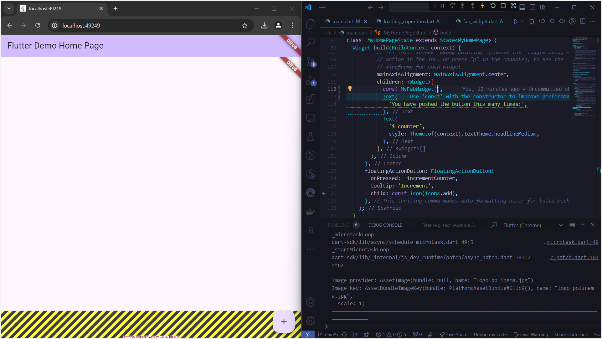

### Langkah 3 | Scaffold Widget

- Mengganti seluruh kode pada `main.dart` dengan kode : 
```dart
import 'package:flutter/material.dart';

void main() {
  runApp(const MyApp());
}

class MyApp extends StatelessWidget {
  const MyApp({Key? key}) : super(key: key);

  // This widget is the root of your application.
  @override
  Widget build(BuildContext context) {
    return MaterialApp(
      title: 'Flutter Demo',
      theme: ThemeData(
        primarySwatch: Colors.red,
      ),
      home: const MyHomePage(title: 'My Increment App'),
    );
  }
}

class MyHomePage extends StatefulWidget {
  const MyHomePage({Key? key, required this.title}) : super(key: key);

  final String title;

  @override
  State<MyHomePage> createState() => _MyHomePageState();
}

class _MyHomePageState extends State<MyHomePage> {
  int _counter = 0;

  void _incrementCounter() {
    setState(() {
      _counter++;
    });
  }

  @override
  Widget build(BuildContext context) {
    return Scaffold(
      appBar: AppBar(
        title: Text(widget.title),
      ),
      body: Center(
        child: Column(
          mainAxisAlignment: MainAxisAlignment.center,
          children: <Widget>[
            const Text(
              'You have pushed the button this many times:',
            ),
            Text(
              '$_counter',
              style: Theme.of(context).textTheme.headlineMedium,
            ),
          ],
        ),
      ),
      bottomNavigationBar: BottomAppBar(
        child: Container(
          height: 50.0,
        ),
      ),
      floatingActionButton: FloatingActionButton(
        onPressed: _incrementCounter,
        tooltip: 'Increment Counter',
        child: const Icon(Icons.add),
      ),
      floatingActionButtonLocation: FloatingActionButtonLocation.centerDocked,
    );
  }
}
```

Hasil :
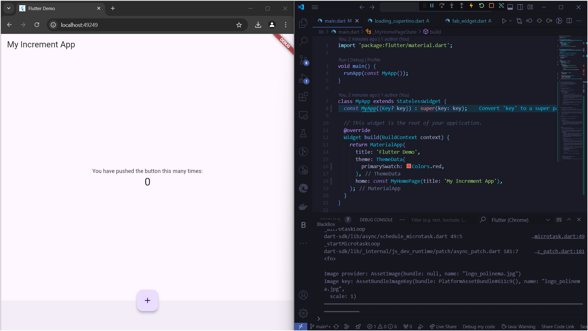

### Langkah 4 | Dialog Widget

- Mengubah semua kode pada `main.dart` dengan kode :

```dart
import 'package:flutter/material.dart';

void main() {
  runApp(const MyApp());
}

class MyApp extends StatelessWidget {
  const MyApp({Key? key}) : super(key: key);

  @override
  Widget build(BuildContext context) {
    return const MaterialApp(
      home: Scaffold(
        body: MyLayout(),
      ),
    );
  }
}

class MyLayout extends StatelessWidget {
  const MyLayout({Key? key}) : super(key: key);

  @override
  Widget build(BuildContext context) {
    return Padding(
      padding: const EdgeInsets.all(8.0),
      child: ElevatedButton(
        child: const Text('Show alert'),
        onPressed: () {
          showAlertDialog(context);
        },
      ),
    );
  }
}

showAlertDialog(BuildContext context) {
  // set up the button
  Widget okButton = TextButton(
    child: const Text("OK"),
    onPressed: () {
      Navigator.pop(context);
    },
  );

  // set up the AlertDialog
  AlertDialog alert = AlertDialog(
    title: const Text("My title"),
    content: const Text("This is my message."),
    actions: [
      okButton,
    ],
  );

  // show the dialog
  showDialog(
    context: context,
    builder: (BuildContext context) {
      return alert;
    },
  );
}
```

Hasil :

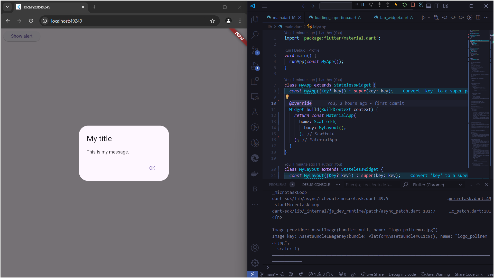

### Langkah 5 | Input dan Selected Text

- Mengubah kode pada file `main.dart` pada baguan class MyApp menjadi : 
```dart
class MyApp extends StatelessWidget {
  const MyApp({Key? key}) : super(key: key);

  @override
  Widget build(BuildContext context) {
    return MaterialApp(
      home: Scaffold(
        appBar: AppBar(title: const Text("Contoh TextField")),
        body: const TextField(
          obscureText: false,
          decoration: InputDecoration(
            border: OutlineInputBorder(),
            labelText: 'Nama',
          ),
        ),
      ),
    );
  }
}
```

Hasil : 

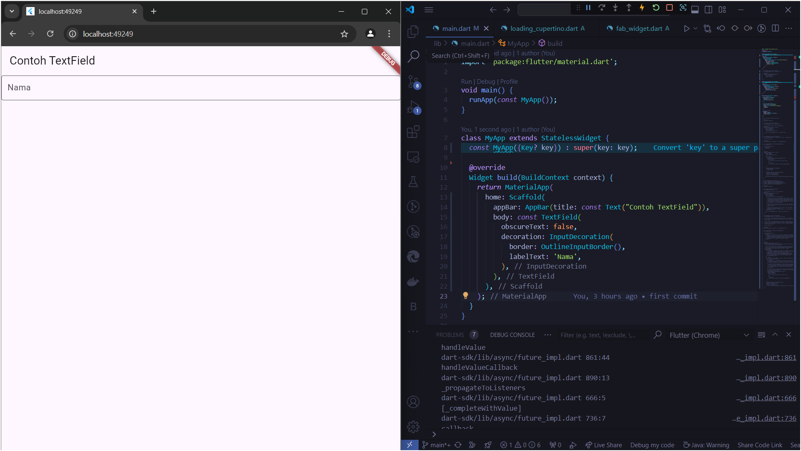

### Langkah 6 | Date and Time Pickers 
- Mengubah kode pada file `main.dart` pada bagian class MyApp menjadi :
```dart
import 'dart:async';
import 'package:flutter/material.dart';

void main() => runApp(const MyApp());

class MyApp extends StatelessWidget {
  const MyApp({Key? key}) : super(key: key);

  @override
  Widget build(BuildContext context) {
    return const MaterialApp(
      title: 'Contoh Date Picker',
      home: MyHomePage(title: 'Contoh Date Picker'),
    );
  }
}

class MyHomePage extends StatefulWidget {
  const MyHomePage({Key? key, required this.title}) : super(key: key);

  final String title;

  @override
  _MyHomePageState createState() => _MyHomePageState();
}

class _MyHomePageState extends State<MyHomePage> {
  // Variable/State untuk mengambil tanggal
  DateTime selectedDate = DateTime.now();

  //  Initial SelectDate FLutter
  Future<void> _selectDate(BuildContext context) async {
    // Initial DateTime FIinal Picked
    final DateTime? picked = await showDatePicker(
        context: context,
        initialDate: selectedDate,
        firstDate: DateTime(2015, 8),
        lastDate: DateTime(2101));
    if (picked != null && picked != selectedDate) {
      setState(() {
        selectedDate = picked;
      });
    }
  }

  @override
  Widget build(BuildContext context) {
    return Scaffold(
      appBar: AppBar(
        title: Text(widget.title),
      ),
      body: Center(
        child: Column(
          mainAxisSize: MainAxisSize.min,
          children: <Widget>[
            Text("${selectedDate.toLocal()}".split(' ')[0]),
            const SizedBox(
              height: 20.0,
            ),
            ElevatedButton(
              onPressed: () => {
                _selectDate(context),
                // ignore: avoid_print
                print(selectedDate.day + selectedDate.month + selectedDate.year)
              },
              child: const Text('Pilih Tanggal'),
            ),
          ],
        ),
      ),
    );
  }
}
```

Hasil : 

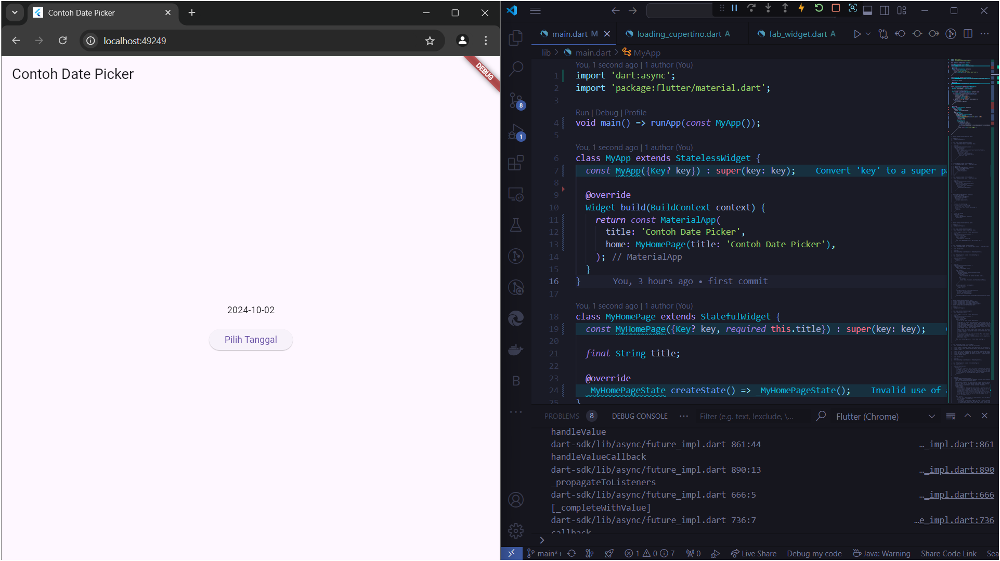

## Tugas Praktikum | Codelabs Google

### no. 1 | First Hot Reload

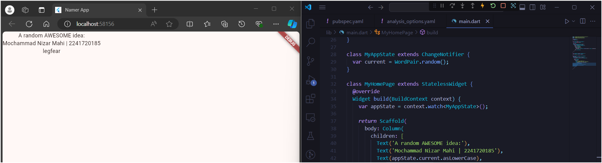

### no. 2 | Adding a Button

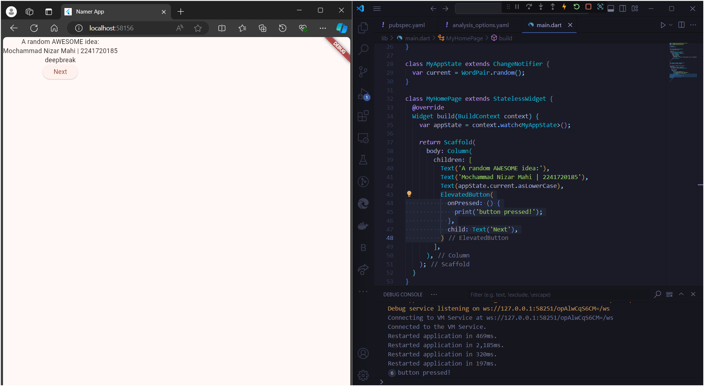

### no. 3 | Add Card

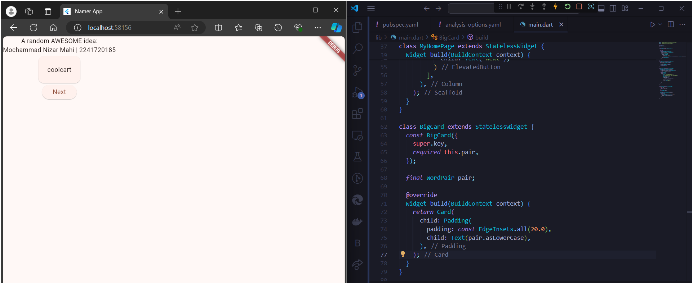

### no. 4 | Theme and Style

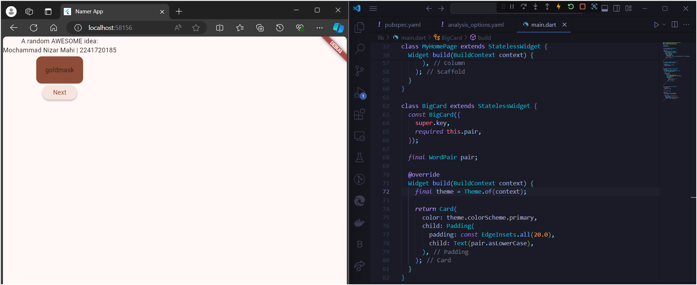

### no. 5 | TextTheme

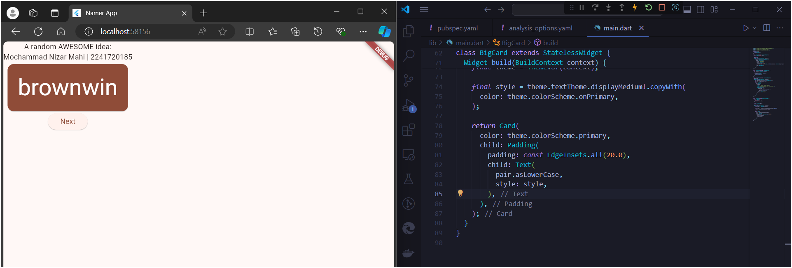
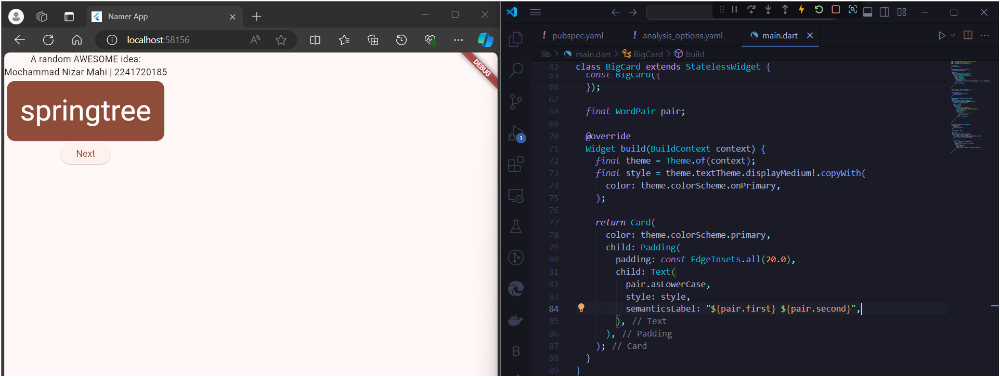

### no. 6 | Center the UI

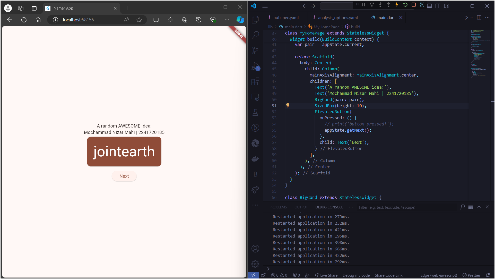

### no. 7 | Add Function and Add Button

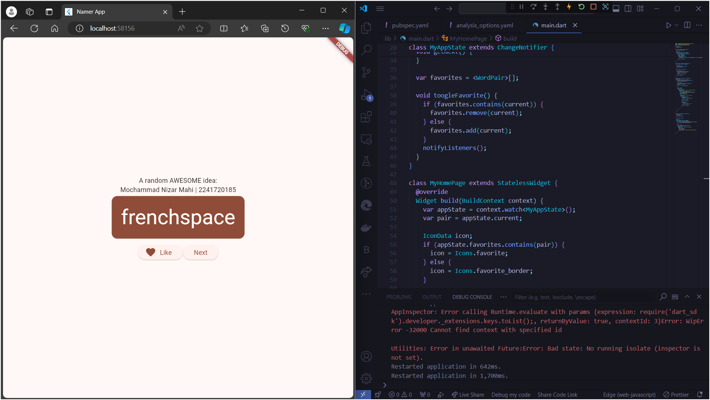

### no. 8 | Add Navigation Rail

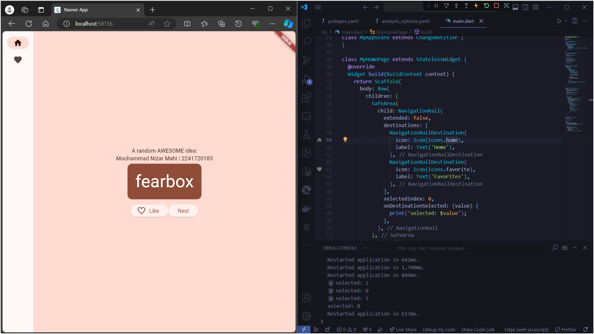

### no. 9 | SetState

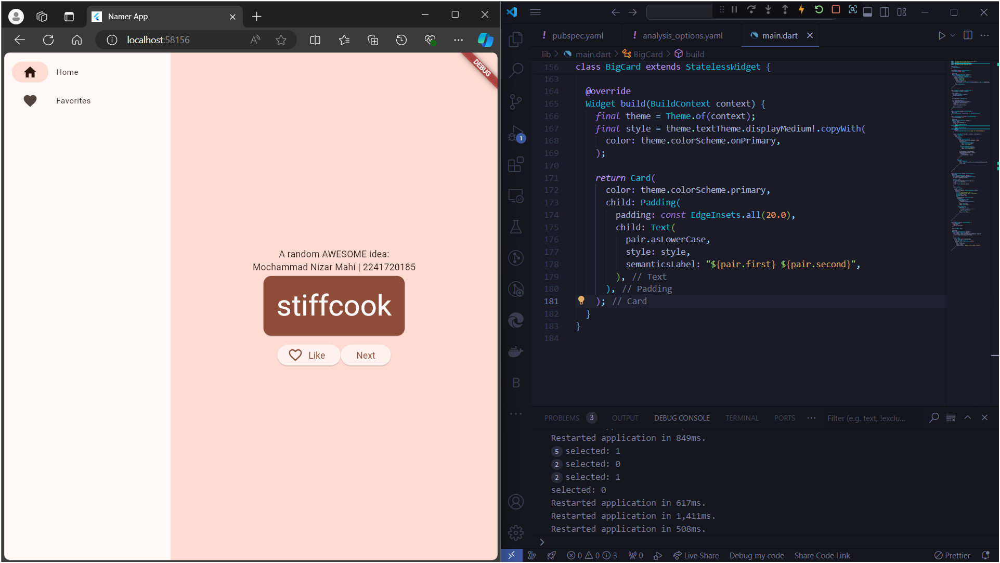

### no. 10 | Add New Page

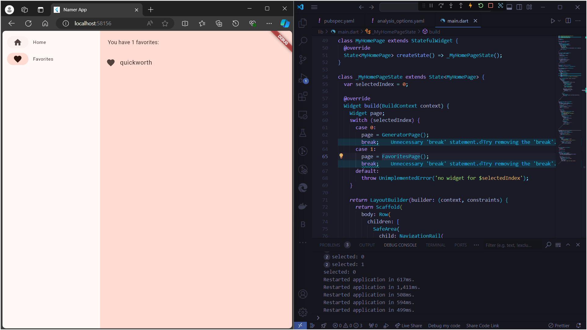

