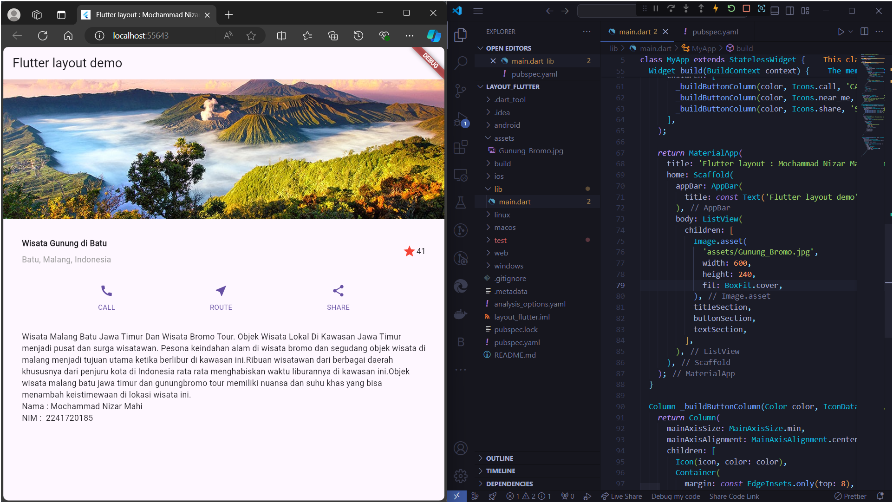

# *06 | Layout dan Navigasi*

**Nama** : Mochammad Nizar Mahi

**NIM** : 2241720185

**Kelas** : TI-3F / 13

---

[layout_flutter](https://github.com/nizarmahi/layout_flutter)

## Praktikum 1 | Membangun Layout di Flutter

Hasil Praktikum 1 : 

## Praktikum 2 | Implementasi Button Row

Hasil Praktikum 2 : 

## Praktikum 3 | Implementasi Text Section

Hasil Praktikum 3 :

## Praktikum 4 | Implementasi Image Section

Hasil Praktikum 4 :

## Tugas Praktikum 1 | Basic Layout Flutter

- Link Repository : [layout_flutter](https://github.com/nizarmahi/layout_flutter)

Hasil Tugas Praktikum 1 : 

## Praktikum 5 | Membangun Navigasi di Flutter

## Tugas Praktikum 2 | 

- Link Repository : [belanja](https://github.com/nizarmahi/belanja)

Hasil Tugas Praktikum 2 : 

