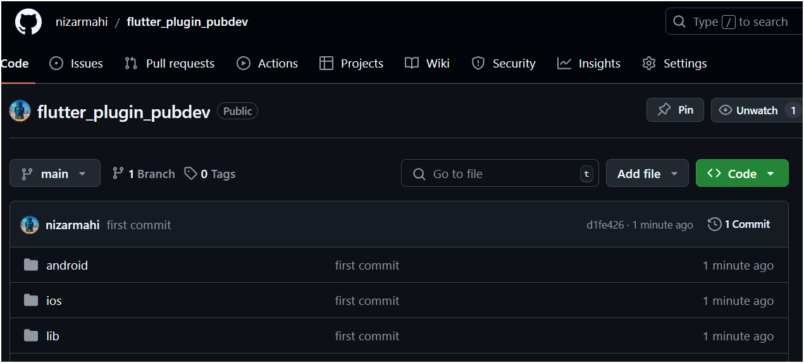
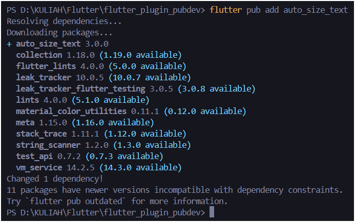
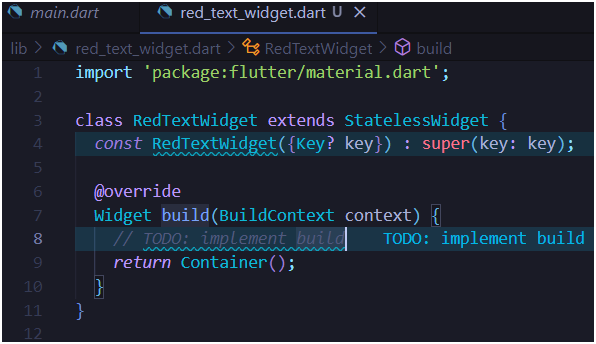
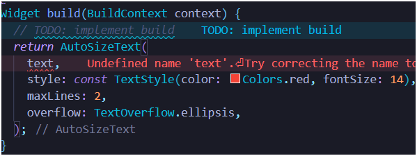
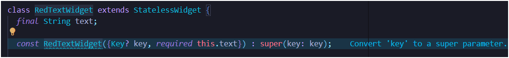
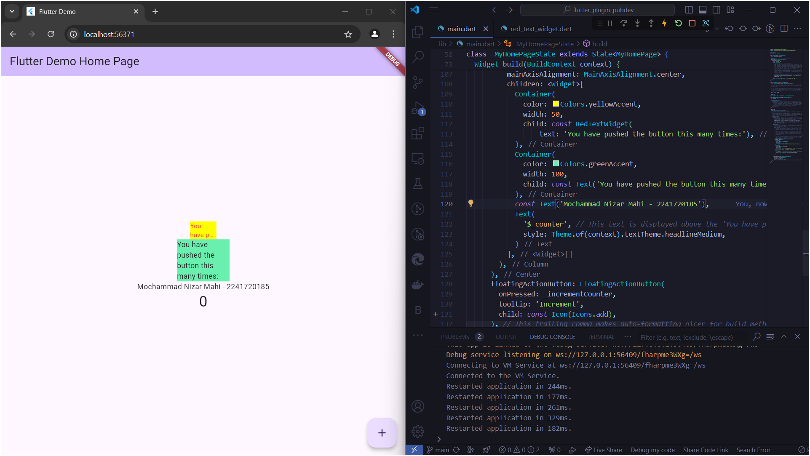

# *06 | Manajemen Plug In*

**Nama** : Mochammad Nizar Mahi

**NIM** : 2241720185

**Kelas** : TI-3F / 13

---

## Praktikum Menerapkan Plugin di Project Flutter

### Langkah 1 : Buat Project Baru

Membuat project baru dengan nama `flutter_plugin_pubdev`, lalu jadikan repository di GitHub Anda dengan nama `flutter_plugin_pubdev`.



### Langkah 2 : Menambahkan Plugin

Tambahkan plugin `auto_size_text` menggunakan perintah berikut di terminal

```
flutter pub add auto_size_text
```



### Langkah 3 : Buat file red_text_widget.dart

Buat file baru bernama `red_text_widget.dart` di dalam folder lib lalu isi kode seperti berikut.

```dart
import 'package:flutter/material.dart';

class RedTextWidget extends StatelessWidget {
    const RedTextWidget({Key? key} : super(key: key));

    @override
    Widget build(BuildContext context) {
        return Container();
    }
}
```

<!--  -->

### Langkah 4 : Tambah Widget AutoSizeText

Masih di file `red_text_widget.dart`, untuk menggunakan plugin `auto_size_text`, ubahlah kode return Container() menjadi seperti berikut.

```dart
...
return AutoSizeText(
      text,
      style: const TextStyle(color: Colors.red, fontSize: 14),
      maxLines: 2,
      overflow: TextOverflow.ellipsis,
);
```

<!--  -->

Setelah Anda menambahkan kode di atas, Anda akan mendapatkan info error. Mengapa demikian? Jelaskan dalam laporan praktikum Anda!

* eror terjadi karena variabel "text" belum di buat / diinisiasikan.

### Langkah 5 : Membuat Variabel Text dan Parameter di Constructor

Tambahkan Variabel `Text` dan parameter di constructor seperti berikut : 

```dart
class RedTextWidget extends StatelessWidget {
    final String text;

    const RedTextWidget({Key? key, required this.text}) : super(key: key);
}

```

<!--  -->

### Langkah 6 : Tambahkan widget di main.dart

Buka file `main.dart` lalu tambahkan di dalam `children:` pada class `_MyHomePageState`.

```dart
...
Container(
   color: Colors.yellowAccent,
   width: 50,
   child: const RedTextWidget(
             text: 'You have pushed the button this many times:',
          ),
),
Container(
    color: Colors.greenAccent,
    width: 100,
    child: const Text(
           'You have pushed the button this many times:',
          ),
),
```

Contoh Hasil Running : 



## Tugas Praktikum 

### 1. Selesaikan Praktikum tersebut, lalu dokumentasikan dan push ke repository Anda berupa screenshot hasil pekerjaan beserta penjelasannya di file README.md!

### 2. Jelaskan maksud dari langkah 2 pada praktikum tersebut!

* Perintah teresebut digunakan untuk menambahkan paket `auto_size_text` ke dalam project yang digunakan. Paket ini memungkinkan Anda untuk membuat teks yang secara otomatis menyesuaikan ukuran font-nya agar muat dalam area yang ditentukan. Ini sangat berguna untuk antarmuka pengguna yang responsif, di mana ruang untuk teks bisa bervariasi.

### 3. Jelaskan maksud dari langkah 5 pada praktikum tersebut!

* Perintah tersebut digunakan untuk membuat sebuah widget baru yang bernama `RedTextWidget`. 
* Widget ini memiliki dua parameter: `text` dan `key`.
* Parameter `text` digunakan untuk menampilkan teks yang diinginkan, sedangkan
* Parameter `key` digunakan untuk memberikan identitas unik pada widget.
* Widget ini kemudian digunakan di dalam `Container` untuk menampilkan teks dengan warna merah.

### 4. Pada langkah 6 terdapat dua widget yang ditambahkan, jelaskan fungsi dan perbedaannya!

*Fungsi*

1. Container Pertama (Dengan RedTextWidget):
* Warna Latar: Colors.yellowAccent
* Lebar: 50
* Teks: Menggunakan widget RedTextWidget (yang diasumsikan merupakan widget kustom untuk menampilkan teks berwarna merah).
* Fungsi: Menampilkan teks dalam lebar yang sangat sempit (50 pixel) dan mungkin memiliki efek khusus dari widget RedTextWidget.

2. Container Kedua (Dengan Text):

* Warna Latar: Colors.greenAccent
* Lebar: 100
* Teks: Menggunakan widget Text standar.
* Fungsi: Menampilkan teks dalam lebar yang sedikit lebih lebar (100 pixel) dengan teks default.

*Perbedaan*

1. Widget Teks:

* RedTextWidget: Kemungkinan memiliki kustomisasi tertentu, seperti warna, ukuran, atau gaya teks yang lebih spesifik.
* Text: Widget standar yang menampilkan teks tanpa modifikasi tambahan, menggunakan pengaturan default.

2. Lebar Container:

* Container pertama lebih sempit (50 pixel) dibandingkan dengan yang kedua (100 pixel). Ini memengaruhi tampilan teks, terutama jika teks terlalu panjang.

3. Warna Latar:

* Container pertama memiliki warna kuning, sedangkan yang kedua berwarna hijau. Ini memberikan kontras visual yang berbeda.

4. Responsivitas:

* Container pertama mungkin lebih terbatas dalam hal berapa banyak teks yang dapat ditampilkan sebelum terpotong, sedangkan yang kedua dapat menampung lebih banyak teks dengan lebar yang lebih besar.

### 5. Jelaskan maksud dari tiap parameter yang ada di dalam plugin auto_size_text berdasarkan tautan pada dokumentasi [ini](https://pub.dev/documentation/auto_size_text/latest/) !

Parameter yang tersedia dalam plugin auto_size_text:

* text: Teks yang akan ditampilkan.
* style: Gaya teks yang akan diterapkan.
* minFontSize: Ukuran font minimum yang diizinkan.
* maxFontSize: Ukuran font maksimum yang diizinkan.
* maxLines: Jumlah baris maksimum yang diizinkan.
* overflow: Bagaimana teks yang meluap akan ditangani.
* textAlign: Penjajaran teks.
* textDirection: Arah teks.
* wrapWords: Menentukan apakah kata-kata akan dibungkus.
* presetFontSizes: Daftar ukuran font yang telah ditentukan sebelumnya.
* stepGranularity: Langkah perubahan ukuran font.
* group: Grup penyesuaian ukuran teks.
