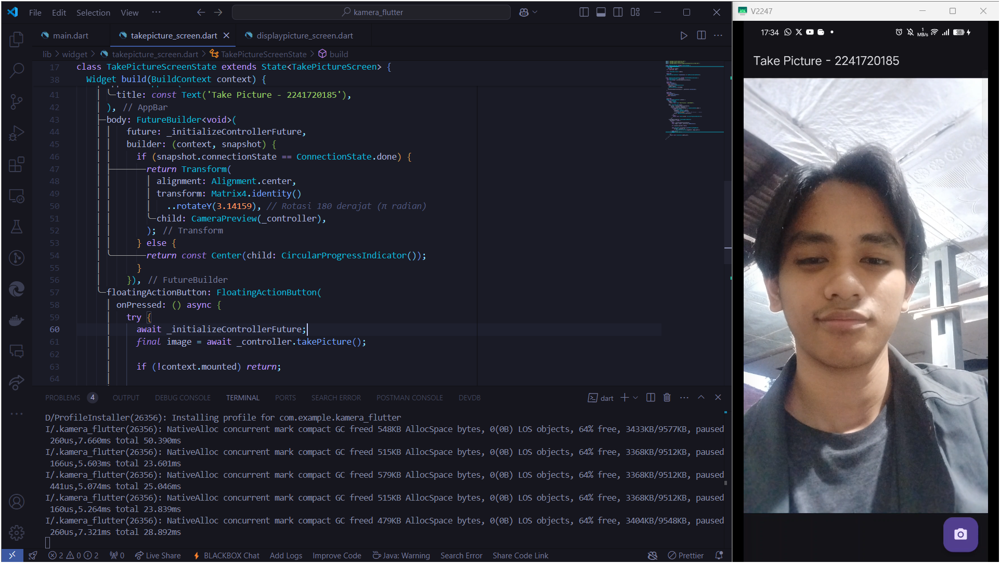
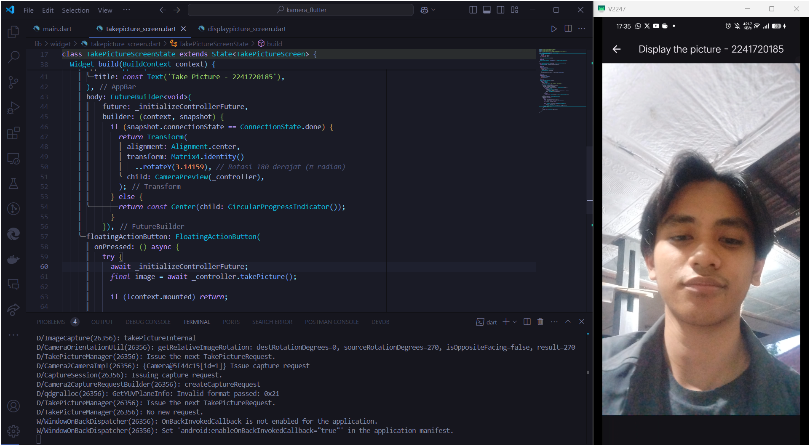
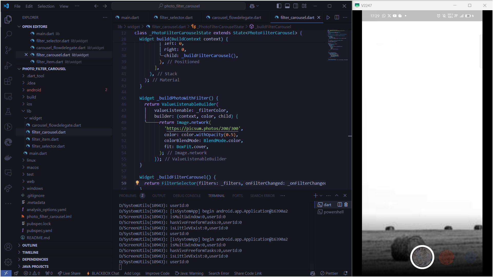

# *09 | Kamera*

**Nama** : Mochammad Nizar Mahi

**NIM** : 2241720185

**Kelas** : TI-3F / 13

---

## Praktikum 1 : Mengambil Foto dengan Kamera di Flutter

### Tampilan saat ingin mengambil gambar

### Tampilan menampilkan gambar yang sebelumnya sudah ditangkap

## Praktikum 2 : Membuat Photo filter carousel
### Tampilan carousel filter foto

## Tugas Praktikum

### 1. Selesaikan Praktikum 1 dan 2, lalu dokumentasikan dan push ke repository Anda berupa screenshot setiap hasil pekerjaan beserta penjelasannya di file README.md! Jika terdapat error atau kode yang tidak dapat berjalan, silakan Anda perbaiki sesuai tujuan aplikasi dibuat!

### 2. Gabungkan hasil praktikum 1 dengan hasil praktikum 2 sehingga setelah melakukan pengambilan foto, dapat dibuat filter carouselnya!

`Jawab` : 

### 3. Jelaskan maksud void async pada praktikum 1?

`Jawab` : 

### 4. Jelaskan fungsi dari anotasi @immutable dan @override ?

`Jawab` : 

### 5. Kumpulkan link commit repository GitHub Anda kepada dosen yang telah disepakati!