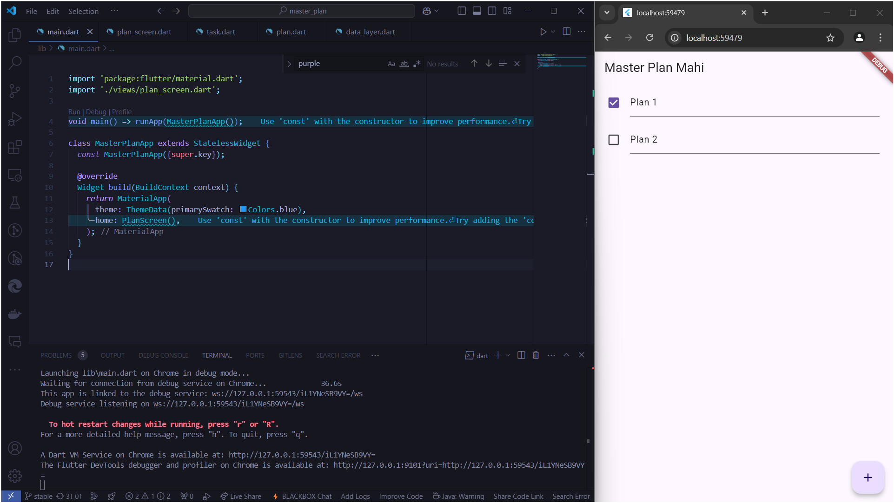
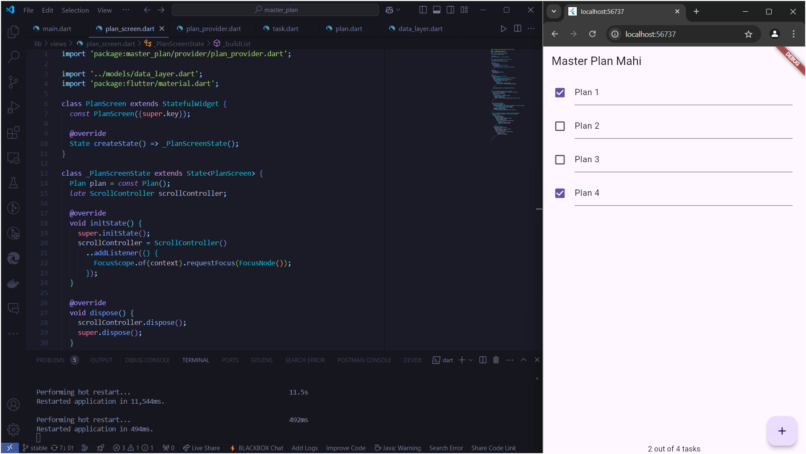
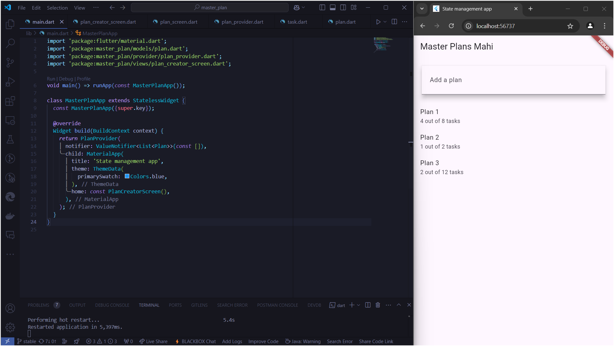

# *10 | Dasar State Management*

**Nama** : Mochammad Nizar Mahi

**NIM** : 2241720185

**Kelas** : TI-3F / 13

---

## Praktikum 1 : Dasar State dengan Model-View

## Tugas Praktikum 1 : Dasar State dengan Model-View

### 1. Selesaikan langkah-langkah praktikum tersebut, lalu dokumentasikan berupa GIF hasil akhir praktikum beserta penjelasannya di file README.md! Jika Anda menemukan ada yang error atau tidak berjalan dengan baik, silakan diperbaiki.

### 2. Jelaskan maksud dari langkah 4 pada praktikum tersebut! Mengapa dilakukan demikian?

    Langkah tersebut bertujuan untuk menyederhanakan pengelolaan dan impor file dengan membuat satu file bernama data_layer.dart yang mengekspor file-file lain, seperti plan.dart dan task.dart. Hal ini dilakukan untuk meningkatkan skalabilitas, mempermudah proses impor di berbagai bagian aplikasi, dan menjaga konsistensi kode. Dengan begitu, saat struktur folder berubah atau model baru ditambahkan, cukup modifikasi file data_layer.dart tanpa perlu mengubah banyak bagian lain di kode. Teknik ini membuat arsitektur aplikasi lebih rapi, modular, dan mudah dikelola seiring perkembangan proyek.

### 3. Mengapa perlu variabel plan di langkah 6 pada praktikum tersebut? Mengapa dibuat konstanta ?

    Variabel plan diperlukan pada langkah tersebut untuk merepresentasikan sebuah instance dari model Plan, yang kemungkinan digunakan sebagai data utama dalam tampilan PlanScreen. Variabel ini dibuat sebagai konstanta (const) untuk memastikan bahwa nilainya tidak berubah selama siklus hidup widget, sehingga menjaga efisiensi dan keandalan aplikasi. Dengan mendeklarasikan plan sebagai const, Flutter dapat mengoptimalkan pengelolaan memori karena objek ini dianggap tetap, terutama jika hanya digunakan untuk referensi data statis atau default. Hal ini juga membantu menghindari modifikasi yang tidak disengaja pada instance Plan.

### 4. Lakukan capture hasil dari Langkah 9 berupa GIF, kemudian jelaskan apa yang telah Anda buat!

### 5. Apa kegunaan method pada Langkah 11 dan 13 dalam lifecyle state ?

    Pada langkah 11 (initState) dan 13 (dispose), kedua metode tersebut merupakan bagian dari lifecycle State dalam Flutter, digunakan untuk mengelola siklus hidup widget Stateful.
    
    - initState(): Digunakan untuk inisialisasi objek dan konfigurasi yang hanya dilakukan sekali saat widget pertama kali dibuat. Dalam contoh ini, scrollController diinisialisasi dan ditambahkan listener yang memastikan fokus input dihapus ketika pengguna menggulir (menggunakan FocusScope.of(context).requestFocus(FocusNode())). Hal ini berguna untuk memperbaiki pengalaman pengguna, seperti menghilangkan keyboard saat menggulir.
    
    - dispose(): Dipanggil saat widget dihapus dari widget tree dan digunakan untuk membersihkan sumber daya, seperti controller atau listener, yang tidak lagi diperlukan. Dalam kasus ini, scrollController.dispose() memutus hubungan dengan elemen scroll sehingga mencegah kebocoran memori.

### 6. Kumpulkan laporan praktikum Anda berupa link commit atau repository GitHub ke dosen yang telah disepakati !

## Praktikum 2 : Mengelola Data Layer dengan InheritedWidget dan InheritedNotifier 

## Tugas Praktikum 2 : InheritedWidget

### 1. Selesaikan langkah-langkah praktikum tersebut, lalu dokumentasikan berupa GIF hasil akhir praktikum beserta penjelasannya di file README.md! Jika Anda menemukan ada yang error atau tidak berjalan dengan baik, silakan diperbaiki sesuai dengan tujuan aplikasi tersebut dibuat.

### 2. Jelaskan mana yang dimaksud InheritedWidget pada langkah 1 tersebut! Mengapa yang digunakan InheritedNotifier?

    Pada kode tersebut, PlanProvider adalah implementasi dari InheritedNotifier, yang merupakan turunan dari InheritedWidget. InheritedWidget digunakan sebagai mekanisme untuk membuat data atau state tersedia di seluruh tree widget tanpa harus meneruskannya secara eksplisit melalui constructor di setiap level. Dalam hal ini, InheritedNotifier dipilih karena memungkinkan integrasi dengan ValueNotifier, yang merupakan objek Listenable untuk memantau perubahan nilai. Penggunaan InheritedNotifier lebih efisien dibandingkan InheritedWidget biasa karena hanya memicu rebuild pada widget anak saat ValueNotifier berubah, sehingga mengurangi overhead rendering dan meningkatkan performa, terutama untuk aplikasi dengan state yang sering diperbarui.

### 3. Jelaskan maksud dari method di langkah 3 pada praktikum tersebut! Mengapa dilakukan demikian?

    Pada langkah tersebut, dua properti getter, yaitu completedCount dan completenessMessage, digunakan untuk menghitung jumlah tugas yang telah selesai dan menghasilkan pesan mengenai status penyelesaian tugas.
    
    - completedCount: Getter ini menghitung jumlah tugas yang telah diselesaikan dengan memfilter daftar tasks menggunakan metode .where() berdasarkan kondisi task.complete (asumsi complete adalah properti boolean dari objek task). Hasilnya adalah jumlah tugas yang memenuhi kondisi tersebut, dihitung dengan .length.
    
    - completenessMessage: Getter ini menggunakan nilai completedCount dan panjang daftar tasks untuk menghasilkan pesan berupa string, seperti "3 out of 10 tasks," yang memberikan gambaran status penyelesaian tugas secara ringkas.

### 4. Lakukan capture hasil dari Langkah 9 berupa GIF, kemudian jelaskan apa yang telah Anda buat!

### 5. Kumpulkan laporan praktikum Anda berupa link commit atau repository GitHub ke dosen yang telah disepakati !

## Praktikum 3 : Membuat State di Multiple Screens

## Tugas Praktikum 3 : Membuat State di Multiple Screens
### 1. Selesaikan langkah-langkah praktikum tersebut, lalu dokumentasikan berupa GIF hasil akhir praktikum beserta penjelasannya di file README.md! Jika Anda menemukan ada yang error atau tidak berjalan dengan baik, silakan diperbaiki sesuai dengan tujuan aplikasi tersebut dibuat.

### 2. Berdasarkan Praktikum 3 yang telah Anda lakukan, jelaskan maksud dari gambar diagram berikut ini!

    
    Diagram tersebut menjelaskan proses transisi antar layar pada aplikasi Flutter. Layar awal (kiri) adalah tempat input dan pengelolaan data, sedangkan layar tujuan (kanan) adalah tampilan yang lebih lengkap dengan elemen tambahan seperti SafeArea untuk tata letak yang lebih aman. Proses navigasi menggunakan Navigator.push memungkinkan transisi ke layar baru dengan widget yang lebih kompleks atau berbeda.

### 3. Lakukan capture hasil dari Langkah 14 berupa GIF, kemudian jelaskan apa yang telah Anda buat!

### 4. Kumpulkan laporan praktikum Anda berupa link commit atau repository GitHub ke dosen yang telah disepakati !

