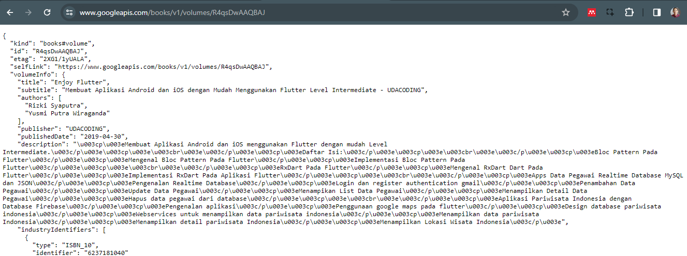

# *11 | Pemrograman Asynchronous*

**Nama** : Mochammad Nizar Mahi

**NIM** : 2241720185

**Kelas** : TI-3F / 13

---

# Praktikum 1 : Mengubah Data dari Web Service (API)

## Langkah 1 : Buat Project Baru
Buatlah sebuah project flutter baru dengan nama **books** di folder **src week-11** repository GitHub Anda.

Kemudian Tambahkan dependensi `http` dengan mengetik perintah berikut di terminal.
```
flutter pub add http
```

## Langkah 2 : Cek file pubspec.yaml
Cek file `pubspec.yaml` untuk memastikan bahwa dependensi `http` telah ada pada file `pubspec.yaml`
```yaml
dependencies:
  flutter:
    sdk: flutter
  cupertino_icons: ^1.0.8
  http: ^1.2.2
``` 

## Langkah 3 : Buka file main.dart

>**Soal 1**  
Tambahkan **nama panggilan Anda** pada `title` app sebagai identitas hasil pekerjaan Anda.


```dart
import 'dart:async';
import 'package:flutter/material.dart';
import 'package:http/http.dart';
import 'package:http/http.dart' as http;

void main() {
  runApp(const MyApp());
}

class MyApp extends StatelessWidget {
  const MyApp({super.key});

  @override
  Widget build(BuildContext context) {
    return MaterialApp(
      title: 'Flutter Demo Mahi',
      theme: ThemeData(
        primarySwatch: Colors.blue,
        visualDensity: VisualDensity.adaptivePlatformDensity,
      ),
      home: const FuturePage(),
    );
  }
}

class FuturePage extends StatefulWidget {
  const FuturePage({super.key});

  @override
  State<StatefulWidget> createState() => _FuturePageState();
}

class _FuturePageState extends State<FuturePage> {
  String result = '';
  @override
  Widget build(BuildContext context) {
    return Scaffold(
      appBar: AppBar(
        title: const Text('Mahi Back from the future'),
      ),
      body: Center(
        child: Column(children: [
          const Spacer(),
          ElevatedButton(
            child: const Text('GO!'),
            onPressed: () {},
          ),
          const Spacer(),
          Text(result),
          const Spacer(),
          const CircularProgressIndicator(),
          const Spacer(),
        ]),
      ),
    );
  }
}
```

## Langkah 4 : Tambah method getData()

Tambahkan method ini ke dalam `class _FuturePageState` yang berguna untuk mengambil data dari API Google Books.
```dart
  Future<Response> getData() async {
    const authority = 'www.googleapis.com';
    const path = '/books/v1/volumes/junbDwAAQBAJ';
    Uri url = Uri.https(authority, path);
    return http.get(url);
  }
```

>**Soal 2**
> * Carilah judul buku favorit Anda di Google Books, lalu ganti ID buku pada variabel path di kode tersebut. Caranya ambil di URL browser Anda seperti gambar berikut ini.
> 
> * Kemudian cobalah akses di browser URI tersebut dengan lengkap seperti ini. Jika menampilkan data JSON, maka Anda telah berhasil. Lakukan capture milik Anda dan tulis di README pada laporan praktikum. Lalu lakukan commit dengan pesan "W11: Soal 2".
> 

## Langkah 5 : Tambah kode di ElevatedButton

Tambahkan kode `onPressed` di `ElevatedButton` seperti berikut : 

```dart
ElevatedButton(
    child: const Text('GO!'),
    onPressed: () {
      getData().then((value) {
        result = value.body.toString().substring(0, 450);
        setState(() {});
      }).catchError((_) {
        result = 'An error occured';
        setState(() {});
      });
    },
),
```
>**Soal 3**
> * Jelaskan maksud kode langkah 5 tersebut terkait substring dan catchError!
> * Capture hasil praktikum Anda berupa GIF dan lampirkan di README. Lalu lakukan commit dengan pesan "W11: Soal 3".


# Praktikum 2: Menggunakan await/async untuk menghindari callbacks

## Langkah 1 : Buka file main.dart

Tambahkan tiga method berisi kode seperti berikut di dalam `class _FuturePageState`.

```dart
Future<int> returnOneAsync() async {
  await Future.delayed(const Duration(seconds: 3));
  return 1;
}

Future<int> returnTwoAsync() async {
  await Future.delayed(const Duration(seconds: 3));
  return 2;
}

Future<int> returnThreeAsync() async {
  await Future.delayed(const Duration(seconds: 3));
  return 3;
}
```

## Langkah 2 : Tambah method count()

Lalu tambahkan lagi method ini di bawah ketiga method sebelumnya.

```dart
Future count() async {
    int total = 0;
    total += await returnOneAsync();
    total += await returnTwoAsync();
    total += await returnThreeAsync();
    setState(() {
        result = total.toString();
    });
}
```

## Langkah 3 : Panggil count()
Lakukan comment kode sebelumnya, ubah isi kode onPressed() menjadi seperti berikut.

```dart
ElevatedButton{
  child: Text('GO'),
  onPressed: () {
    count();
  }
}
```

## Langkah 4 : Run
Akhirnya, run atau tekan **F5** jika aplikasi belum running. Maka Anda akan melihat seperti gambar berikut, hasil angka 6 akan tampil setelah delay 9 detik.


>**Soal4**
>* Jelaskan maksud kode langkah 1 dan 2 tersebut!
>* Capture hasil praktikum Anda berupa GIF dan lampirkan di README. Lalu lakukan commit dengan pesan "**W11: Soal 4**".

# Praktikum 3: Menggunakan Completer di Future

## Langkah 1 : Buka main.dart
Pastikan telah impor package async berikut.
```dart
import 'package:async/async.dart';
```

## Langkah 2 : Tambahkan variabel dan method
Tambahkan variabel late dan method di `class _FuturePageState` seperti ini.
```dart
late Completer completer;

Future getNumber() {
  completer = Completer<int>();
  calculate();
  return completer.future;
}

Future calculate() async {
  await Future.delayed(const Duration(seconds : 5));
  completer.complete(42);
}
```

## Langkah 3 : Ganti isi kode onPressed()
Tambahkan kode berikut pada fungsi `onPressed()`. Kode sebelumnya bisa Anda *comment*.

```dart
getNumber().then((value) {
  setState(() {
    result = value.toString();
  });
});
```

## Langkah 4 : Run
Terakhir, run atau tekan F5 untuk melihat hasilnya jika memang belum running. Bisa juga lakukan hot restart jika aplikasi sudah running. Maka hasilnya akan seperti gambar berikut ini. Setelah 5 detik, maka angka 42 akan tampil.
>**Soal 5**
>* Jelaskan maksud kode langkah 2 tersebut!
>* Capture hasil praktikum Anda berupa GIF dan lampirkan di README. Lalu lakukan commit dengan pesan "W11: Soal 5".

## Langkah 5 : Ganti method calculate()
Gantilah isi code method `calculate()` seperti kode berikut, atau Anda dapat membuat `calculate2()`
```dart
calculate() async {
  try {
    await new Future.delayed(const Duration(seconds: 5));
    completer.complete(42);
  }
  catch (_) {
    completer.completeError({});
  }
}
```

## Langkah 6 : Pindah ke onPressed()
Ganti kode di `onPressed()` seperti kode berikut ini.
```dart
getNumber().then((value) {
  setState(() {
    result = value.toString();
  });
}).catchError((e) {
  result = 'An error occurred';
});
```
>**Soal 6**
>* Jelaskan maksud perbedaan kode langkah 2 dengan langkah 5-6 tersebut!
>* Capture hasil praktikum Anda berupa GIF dan lampirkan di README. Lalu lakukan commit dengan pesan "W11: Soal 6".

# Praktikum 4 : Memanggil Future Secara Paralel

## Langkah 1 : Buka file main.dart
