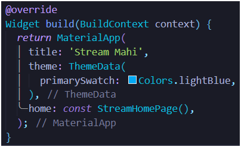
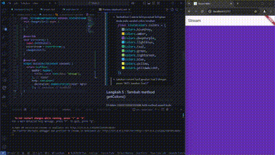

# *12 | Dart Streams*

**Nama** : Mochammad Nizar Mahi

**NIM** : 2241720185

**Kelas** : TI-3F / 13

---

# Praktikum 1 : Dart Streams

## Langkah 1 : Buat Project Baru
Buatlah sebuah project flutter baru dengan nama stream_nama (beri nama panggilan Anda) di folder week-12/src/ repository GitHub Anda.

## Langkah 2: Buka file main.dart
```dart
import 'package:flutter/material.dart';

void main() {
  runApp(const MyApp());
}

class MyApp extends StatelessWidget {
  const MyApp({super.key});

  @override
  Widget build(BuildContext context) {
    return MaterialApp(
      title: 'Stream Mahi',
      theme: ThemeData(
        primarySwatch: Colors.deepPurple,
      ),
      home: const StreamHomePage(),
    );
  }
}

class StreamHomePage extends StatefulWidget {
  const StreamHomePage({super.key});

  @override
  State<StreamHomePage> createState() => _StreamHomePageState();
}

class _StreamHomePageState extends State<StreamHomePage> {
  @override
  Widget build(BuildContext context) {
    return Container();
  }
}
```
>**Soal 1**
>- Tambahkan nama panggilan Anda pada title app sebagai identitas hasil pekerjaan Anda.

>- Gantilah warna tema aplikasi sesuai kesukaan Anda.
Lakukan commit hasil jawaban Soal 1 dengan pesan "W12: Jawaban Soal 1"

## Langkah 3 : Buat file baru stream.dart
Buat file baru di folder lib project Anda. Lalu isi dengan kode berikut.

```dart
import 'package:flutter/material.dart';

class ColorStream {

}
```
## Langkah 4 : Tambah variabel colors
Tambahkan variabel di dalam `class ColorStream `seperti berikut.
```dart
  final List<Color> colors = [
    Colors.blueGrey,
    Colors.amber,
    Colors.deepPurple,
    Colors.lightBlue,
    Colors.teal,
  ];
```

>**Soal 2**
>- Tambahkan 5 warna lainnya sesuai keinginan Anda pada variabel colors tersebut.

>- Lakukan commit hasil jawaban Soal 2 dengan pesan "W12: Jawaban Soal 2"

## Langkah 5 : Tambah method getColors()
Di dalam `class ColorStream` ketik method seperti kode berikut. Perhatikan tanda bintang di akhir keyword `async*` (ini digunakan untuk melakukan `Stream` data)

```dart
Stream<Color> getColors() async* {

}
```
## Langkah 6 Tambah perintah yield*
```dart
yield* Stream.periodic(
  const Duration(seconds: 1), (int t) {
      int index = t % colors.length;
      return colors[index];
    });
```
>**Soal 3**
>- Jelaskan fungsi keyword yield* pada kode tersebut!  
> **Jawaban** : Fungsi keyword `yield*` digunakan untuk mengembalikan nilai stream yang dihasilkan oleh `Stream.periodic` ke atas. Jadi, `yield*` akan mengembalikan stream yang berisi warna-warna yang berubah-ubah setiap 1 detik. Jika ingin mengembalikan stream yang berisi warna-warna yang tetap, maka gunakan saja `yield` saja.
>- Apa maksud isi perintah kode tersebut?  
> **Jawaban** : Maksud kode tersebut adalah mengembalikan stream yang berisi warna-warna yang berubah-ubah setiap 1 detik. Jika ingin mengembalikan stream yang berisi warna-warna yang tetap, maka gunakan saja `yield` saja.
>- Lakukan commit hasil jawaban Soal 3 dengan pesan "W12: Jawaban Soal 3"

## Langkah 7 : Buka main.dart
Ketik kode impor file ini pada file `main.dart`
```dart
import 'stream.dart';
```
## Langkah 8 : Tambah variabel
Ketik dua properti ini di dalam `class _StreamHomePageState`
```dart
Color bgColor = Colors.blueGrey;
late ColorStream colorStream;
```
## Langkah 9 : Tambah method changeColor()
Tetap di file main, Ketik kode seperti berikut
```dart
void changeColor() async {
    await for (var eventColor in colorStream.getColors()) {
      setState(() {
        bgColor = eventColor;
      });
    }
  }
```
## Langkah 10 : Lakukan override initState()
```dart
@override
void initState() {
  super.initState();
  colorStream = ColorStream();
  changeColor();
}
```
## Langkah 11 : Ubah isi scaffold()
```dart
Scaffold(
  appBar: AppBar(
    title: Text('Stream'),
  ),
  body: Container(
    decoration: BoxDecoration(color: bgColor),
  )
)
```
## Langkah 12 : Run

>**Soal 4**
>- Capture hasil praktikum Anda berupa GIF dan lampirkan di README.
>- Lakukan commit hasil jawaban Soal 4 dengan pesan "W12: Jawaban Soal 4"

## Langkah 13 : Ganti isi method changeColor()
Anda boleh comment atau hapus kode sebelumnya, lalu ketika kode seperti berikut.
```dart
colorStream.getColors().listen((eventColor) {
      setState(() {
        bgColor = eventColor;
      });
    });
```

>- Jelaskan perbedaan menggunakan listen dan await for (langkah 9) !
> **- Jawaban:**
> - `listen` digunakan untuk mendengarkan stream, dan akan dipanggil setiap kali ada perubahan pada stream. Sedangkan `await for` digunakan untuk menunggu stream selesai, dan akan dipanggil setelah stream selesai.
> - `listen` lebih cocok digunakan ketika ingin mendengarkan stream secara real-time, sedangkan `await for` lebih cocok digunakan ketika ingin menunggu stream selesai.
> - `listen` akan dipanggil setiap kali ada perubahan pada stream, sedangkan `await for` hanya dipanggil sekali ketika stream selesai.
>- `listen` dapat digunakan untuk mendengarkan stream yang tidak pernah selesai, sedangkan `await for` hanya dapat digunakan untuk mendengarkan stream yang pernah selesai.
>- Lakukan commit hasil jawaban Soal 5 dengan pesan "W12: Jawaban Soal 5"

# Praktikum 2 : Strea controllers dan skins

## Langkah 1 : Buka file stream.dart
Lakukan impor dengan mengetik kode ini.
```dart
import 'dart:async';
```
## Langkah 2 : Tambah class NumberStream
Tetap di file `stream.dart` tambah class baru seperti berikut.
```dart
class NumberStream {

}
```
## Langkah 3 : Tambah method streamController
Di dalam `class NumberStream` buatlah variabel seperti berikut.
```dart
final StreamController<int> controller = StreamController<int>();
```
## Langkah 4 : Tambah method addNumberToSink
Tetap di class NumberStream buatlah method ini
```dart
void addNumberToSink(int number) {
  controller.sink.add(number);
}
```
## Langkah 5 : Tambah method close
Tetap di class NumberStream buatlah method ini
```dart
void close() {
  controller.close();
}
```
## Langkah 6 : Buka main.dart
Ketik kode import seperti berikut.
```dart
import 'dart:async';
import 'dart:math';
```
## Langkah 7 : Tambah variabel
Di dalam `class _StreamHomePageState` ketik variabel berikut
```dart
int lastNumber = 0;
late StreamController numberStreamController;
late NumberStream numberStream;
```
## Langkah 8 : Edit initState()
```dart
void initState() {
    numberStream = NumberStream();
    numberStreamController = numberStream.controller;
    Stream stream = numberStreamController.stream;
    stream.listen((event) {
      setState(() {
        lastNumber = event;
      });
    });

    super.initState();
  }
```
## Langkah 9 : Edit dispose()
```dart
@override
  void dispose() {
    numberStreamController.close();
    super.dispose();
  }
```
## Langkah 10 : Tambah method addRandomNumber()
```dart
void addRandomNumber() {
  Random random = Random();
  int myNum = random.nextInt(10);
  numberStream.addNumberToSink(myNum);
}
```
## Langkah 11 : Edit method build()
```dart
        body: SizedBox(
          width: double.infinity,
          child: Column(
            mainAxisAlignment: MainAxisAlignment.spaceEvenly,
            crossAxisAlignment: CrossAxisAlignment.center,
            children: [
              Text(lastNumber.toString()),
              ElevatedButton(
                  onPressed: () => addRandomNumber(),
                  child: Text('New Random Number')),
            ],
          ),
        ));
```
## Langkah 12 : Run
>.**Soal 6**
>- Jelaskan maksud kode langkah 8 dan 10 tersebut!
>- Capture hasil praktikum Anda berupa GIF dan lampirkan di README.
>- Lalu lakukan commit dengan pesan "W12: Jawaban Soal 6".

## Langkah 13 : Buka stream.dart
Tambahkan method berikut ini.
```dart
addError() {
  controller.sink.addError('Error');
}
```
## Langkah 14 : Buka main.dart
Tambahkan method `onError` di dalam `class StreamHomePageState` pada method listen di fungsi `initState()` seperti berikut ini.
```dart
    stream.listen((event) {
      setState(() {
        lastNumber = event;
      });
    }).onError((error) {
      setState(() {
        lastNumber = -1;
      });
    });
```
## Langkah 15 : Edit method addRandomNumber()
Lakukan comment pada dua baris kode berikut, lalu ketik kode seperti berikut ini.
```dart
  void addRandomNumber() {
    Random random = Random();
    // int myNum = random.nextInt(10);
    // numberStream.addNumberToSink(myNum);
    numberStream.addError();
  }
```
>**Soal 7**
>- Jelaskan maksud kode langkah 13 sampai 15 tersebut!  
**Jawab** : 
Kode langkah 13 menambahkan method `addError()` yang akan menambahkan error ke sink controller. Kode langkah 14 menambahkan method `onError` yang akan dipngunakan untuk menangani error yang terjadi pada stream. Kode langkah 15 menambahkan method `addRandomNumber()` yang akan menambahkan error ke stream
>- Capture hasil praktikum Anda berupa GIF dan lampirkan di README.
>- Kembalikan kode seperti semula pada Langkah 15, comment addError() agar Anda dapat melanjutkan ke praktikum 3 berikutnya.
>- Lalu lakukan commit dengan pesan "W12: Jawaban Soal 7".


# Praktikum 3: Injeksi data ke streams

## Langkah 1 : Buka main.dart
Tambahkan variabel baru di dalam class _StreamHomePageState
```dart
  late StreamTransformer transformer;
```
## Langkah 2 : Tambahkan kode ini di initState
```dart
transformer = StreamTransformer<int, int>.fromHandlers(
      handleData: (value, sink) {
        sink.add(value * 10);
      },
      handleError: (error, stackTrace, sink) {
        sink.addError(-1);
      },
      handleDone: (sink) => sink.close(),
    );
```
## Langkah 3 : Tetap di initState
Lakukan edit seperti kode berikut.
```dart
    stream.transform(transformer).listen((event) {
      setState(() {
        lastNumber = event;
      });
    }).onError((error) {
      setState(() {
        lastNumber = -1;
      });
    });
    super.initState();
```
## Langkah 4 : Run
>**Soal 8**
>- Jelaskan maksud kode langkah 1-3 tersebut!  
**Jawab** :  
Kode ini digunakan untuk memproses data dari stream sebelum ditampilkan di aplikasi. Langkah pertama adalah menyiapkan variabel transformer, yang bertugas memodifikasi data. Aturannya dibuat di langkah kedua: data dari stream akan dikalikan 10, error akan diubah menjadi -1, dan stream ditutup jika selesai. Pada langkah terakhir, transformer diterapkan ke stream, dan data hasilnya disimpan ke variabel lastNumber, sehingga UI aplikasi bisa diperbarui secara real-time. Jika terjadi error, lastNumber otomatis diatur ke -1.
>- Capture hasil praktikum Anda berupa GIF dan lampirkan di README.

>- Lalu lakukan commit dengan pesan "W12: Jawaban Soal 8".
# Praktikum 4 : Subscribe ke stream events

## Langkah 1 : Buka Tambah variabel 
## Langkah 2 : Edit initState()
## Langkah 3 : tetap di initState()
## Langkah 4 : Tambah properti onDone()
## Langkah 5 : Tambah method baru
## Langkah 6 : Pindah ke method dispose()
## Langkah 7 : Pindah ke method build()
## Langkah 8 : Edit method addRandomNumber()
## Langkah 9 : Run
## Langkah 10 : Tekan button 'Stop Subscription'
>**Soal 9**
>- Jelaskan maksud kode langkah 2, 6 dan 8 tersebut!
>- Capture hasil praktikum Anda berupa GIF dan lampirkan di README.
>- Lalu lakukan commit dengan pesan "W12: Jawaban Soal 9"
# Praktikum 5 : Multiple stream subscriptions
## Langkah 1 : Buka main.dart
## Langkah 2 : Edit initState()
## Langkah 3 : Run
>**Soal 10**
>- Jelaskan mengapa error itu bisa terjadi
## Langkah 4 : Set broadcast stream
## Langkah 5 : Edit method build()
## Langkah 6 : Run
>**Soal 11**
>- Jelaskan mengapa hal itu bisa terjadi ?
>- Capture hasil praktikum Anda berupa GIF dan lampirkan di README.
>- Lalu lakukan commit dengan pesan "W12: Jawaban Soal 10,11".
# Praktikum 6 : StreamBuilder
## Langkah 1 : Buat Project Baru
## Langkah 2 : Buat file baru stream.dart
## Langkah 3 : Edit file stream.dart
## Langkah 4 : Edit file main.dart
## Langkah 5 : Tambah variabel
## Langkah 6 : Edit method initState()
## Langkah 7 : Edit method build()
## Langkah 8 : Run
>**Soal 12**
>- Jelaskan maksud kode pada langkah 3 dan 7 !
>- Capture hasil praktikum Anda berupa GIF dan lampirkan di README.
>- Lalu lakukan commit dengan pesan "W12: Jawaban Soal 12".
# Praktikum 7 : BLoC Pattern
## Langkah 1: Buat Project baru
Buatlah sebuah project flutter baru dengan nama bloc_random_nama (beri nama panggilan Anda) di folder week-12/src/ repository GitHub Anda. Lalu buat file baru di folder lib dengan nama random_bloc.dart

## Langkah 2: Isi kode random_bloc.dart
Ketik kode impor berikut ini.

## Langkah 3: Buat class RandomNumberBloc()

## Langkah 4: Buat variabel StreamController
Di dalam class RandomNumberBloc() ketik variabel berikut ini

## Langkah 5: Buat constructor

## Langkah 6: Buat method dispose()

## Langkah 7: Edit main.dart

## Langkah 8: Buat file baru random_screen.dart
Di dalam folder lib project Anda, buatlah file baru ini.

## Langkah 9: Lakukan impor material dan random_bloc.dart
Ketik kode ini di file baru random_screen.dart

## Langkah 10: Buat StatefulWidget RandomScreen
Buatlah di dalam file random_screen.dart

## Langkah 11: Buat variabel
Ketik kode ini di dalam class _RandomScreenState

## Langkah 12: Buat method dispose()
Ketik kode ini di dalam class _StreamHomePageState

## Langkah 13: Edit method build()
Ketik kode ini di dalam class _StreamHomePageState

Run aplikasi, maka Anda akan melihat angka acak antara angka 0 sampai 9 setiap kali menekan tombol FloactingActionButton.

>**Soal 13**
>- Jelaskan maksud praktikum ini ! Dimanakah letak konsep pola BLoC-nya ?
>- Capture hasil praktikum Anda berupa GIF dan lampirkan di README.
>- Lalu lakukan commit dengan pesan "W12: Jawaban Soal 13".
Back
